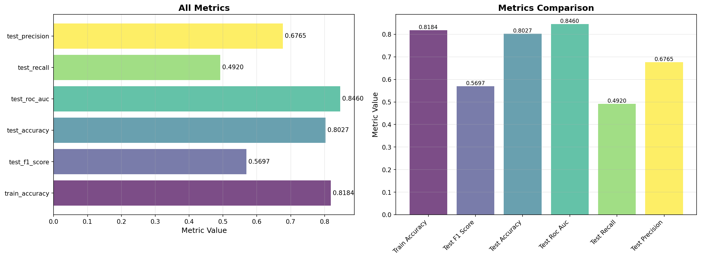
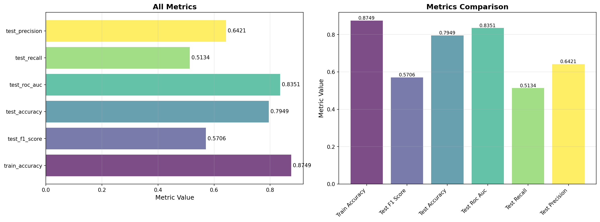

# Experiment Report

Generated automatically from ClearML experiments.

## Project: Churn Prediction Experiments

## Top Models by Metrics

### Top 15 Experiments by test_accuracy

| Task Name | test_accuracy | Task ID |
|-----------|---------------|----------|
| gb_n150_d5_lr005 | 0.8041 | 7baae013... |
| gb_n50_d3_lr01 | 0.8027 | 0b6e2ce3... |
| gb_n100_d5_lr01 | 0.7949 | 5b29847e... |
| gb_enhanced_n200_d7_lr005 | 0.7906 | 652de620... |
| knn_k10 | 0.7878 | c276b00d... |
| rf_n100_unlimited | 0.7850 | 015f0308... |
| rf_enhanced_n300_d15 | 0.7821 | 74b05f3a... |
| rf_n150_d12 | 0.7793 | 8a6ddb71... |
| rf_n100_d8 | 0.7665 | 2c4bae3e... |
| rf_n200_d10 | 0.7665 | 110aea66... |
| knn_k5 | 0.7651 | 53b11bf5... |
| rf_n50_d5 | 0.7395 | 5455e20a... |
| lr_c1 | 0.7374 | 25b5055a... |
| lr_c10 | 0.7367 | a0fb73f1... |
| lr_c01 | 0.7353 | 76e6eac2... |

## Visualizations

### Training Metrics Plots

#### gb_n150_d5_lr005 (ID: 7baae013a0f44a82949ebe87a383e620) - Best by test_accuracy

**Combined Metrics**

#### gb_n50_d3_lr01 (ID: 0b6e2ce371514b58a84c41061d2a4766) - Best by test_accuracy

**Combined Metrics**

#### gb_n100_d5_lr01 (ID: 5b29847efb0e4b739d87a686e6682dc3) - Best by test_accuracy

**Combined Metrics**

## Notes

- Reports are generated automatically from ClearML experiments
- Metrics are extracted from the last scalar metrics or task parameters
- Models are sorted by the specified metric in descending order
- Plots are downloaded from ClearML tasks and embedded in the report

## Reproducibility

To reproduce these results:

1. Ensure ClearML Server is running: `pixi run clearml-server-start`
2. Run experiments: `pixi run churn-experiments`
3. View results in ClearML UI: http://localhost:8080

