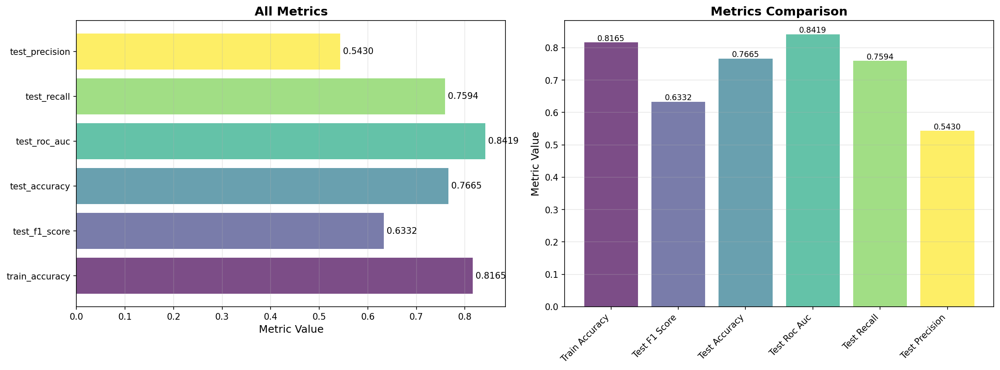
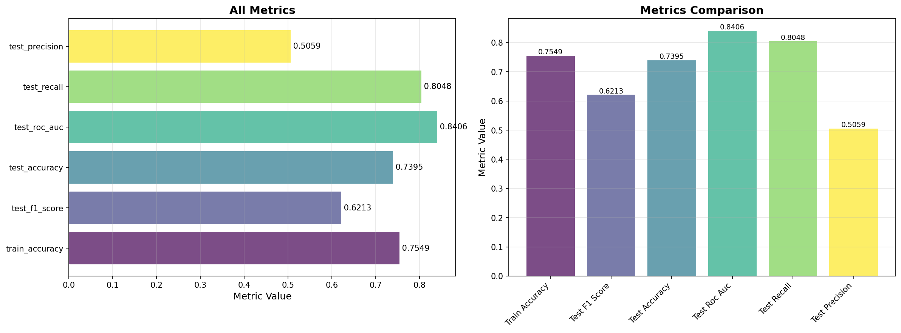
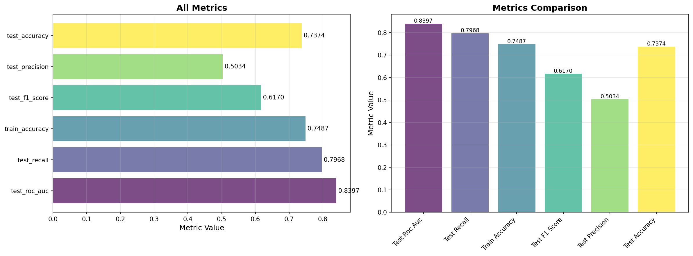

# Experiment Report

Generated automatically from ClearML experiments.

## Project: Churn Prediction Experiments

## Top Models by Metrics

### Top 15 Experiments by test_f1_score

| Task Name | test_f1_score | Task ID |
|-----------|---------------|----------|
| rf_n100_d8 | 0.6332 | 2c4bae3e... |
| rf_n50_d5 | 0.6213 | 5455e20a... |
| lr_c1 | 0.6170 | 25b5055a... |
| lr_c10 | 0.6155 | a0fb73f1... |
| rf_enhanced_n300_d15 | 0.6129 | 74b05f3a... |
| lr_c01 | 0.6119 | 76e6eac2... |
| rf_n200_d10 | 0.6079 | 110aea66... |
| rf_n150_d12 | 0.6048 | 8a6ddb71... |
| gb_n150_d5_lr005 | 0.5856 | 7baae013... |
| dt_d10 | 0.5822 | d5d208d3... |
| gb_enhanced_n200_d7_lr005 | 0.5731 | 652de620... |
| gb_n100_d5_lr01 | 0.5706 | 5b29847e... |
| gb_n50_d3_lr01 | 0.5697 | 0b6e2ce3... |
| rf_n100_unlimited | 0.5346 | 015f0308... |
| dt_d15 | 0.5217 | 2a90b2dc... |

## Visualizations

### Training Metrics Plots

#### rf_n100_d8 (ID: 2c4bae3eb82441c7a9526ac033c53476) - Best by test_f1_score

**Combined Metrics**

#### rf_n50_d5 (ID: 5455e20a73584a0d95525b3eab647ca4) - Best by test_f1_score

**Combined Metrics**

#### lr_c1 (ID: 25b5055a3cab4d178293b7af6cdf9d10) - Best by test_f1_score

**Combined Metrics**

## Notes

- Reports are generated automatically from ClearML experiments
- Metrics are extracted from the last scalar metrics or task parameters
- Models are sorted by the specified metric in descending order
- Plots are downloaded from ClearML tasks and embedded in the report

## Reproducibility

To reproduce these results:

1. Ensure ClearML Server is running: `pixi run clearml-server-start`
2. Run experiments: `pixi run churn-experiments`
3. View results in ClearML UI: http://localhost:8080

