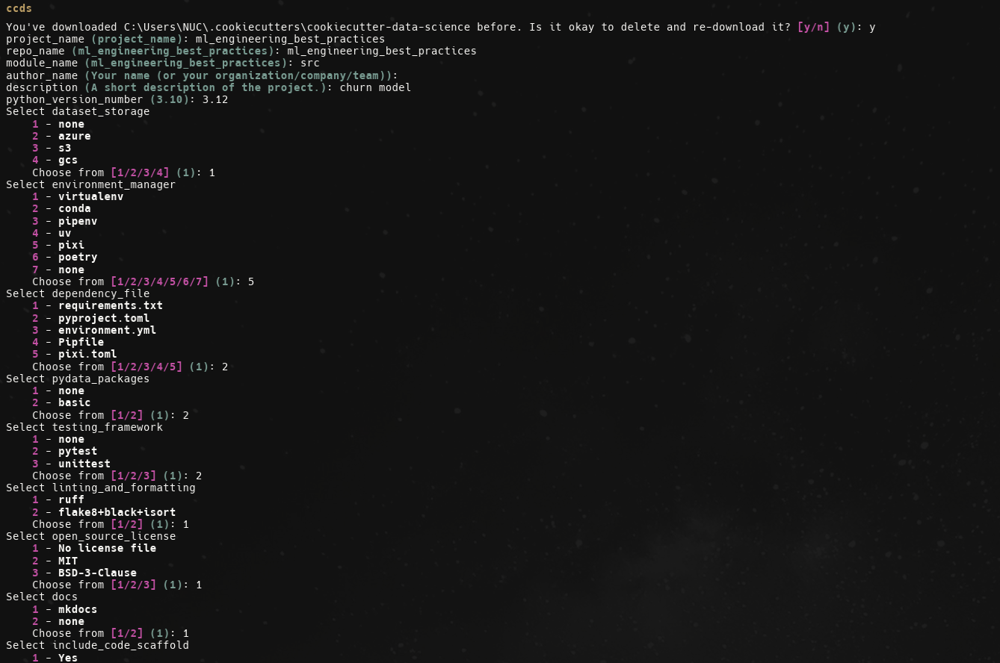
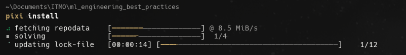

# Отчет о выполнении задания 1

## Описание проекта

Проект представляет собой полноценное рабочее место для Data Science с применением современных инженерных практик. В качестве задачи выбрано предсказание оттока клиентов телекоммуникационной компании на основе датасета [Telco Customer Churn](https://www.kaggle.com/datasets/blastchar/telco-customer-churn) с Kaggle.


## 1. Структура проекта 

### 1.1 Шаблон проекта

Проект организован по шаблону **CookieCutter Data Science**, который обеспечивает стандартизированную структуру для ML проектов. Структура включает:

```
├── data/
│   ├── external/       <- Данные из внешних источников
│   ├── interim/        <- Промежуточные данные после трансформации
│   ├── processed/      <- Финальные датасеты для моделирования
│   └── raw/            <- Оригинальные, неизменяемые данные
├── docs/               <- Документация проекта
├── models/             <- Обученные модели
├── notebooks/           <- Jupyter notebooks
├── reports/             <- Отчеты и анализ
│   └── figures/        <- Графики и визуализации
├── src/                 <- Исходный код проекта
│   ├── config.py       <- Конфигурация и пути
│   ├── dataset.py      <- Загрузка данных
│   ├── features.py     <- Создание признаков
│   ├── modeling/       <- Моделирование
│   │   ├── train.py    <- Обучение модели
│   │   └── predict.py  <- Предсказания
│   └── plots.py        <- Визуализации
├── tests/               <- Тесты
├── pyproject.toml       <- Конфигурация проекта и зависимостей
├── Makefile            <- Команды для автоматизации
├── Dockerfile          <- Конфигурация Docker контейнера
├── .pre-commit-config.yaml <- Конфигурация pre-commit hooks
└── README.md           <- Описание проекта
```



### 1.2 README с описанием проекта

Создан подробный README.md, который включает:
- Описание проекта и его цели
- Структуру проекта
- Инструкции по быстрому старту (Более пдробная инструкция `C:\Users\NUC\Documents\ITMO\ml_engineering_best_practices\docs\docs\getting-started.md`)
- Команды для работы с проектом
- Информацию об использовании Docker


## 2. Качество кода 

### 2.1 Pre-commit hooks

Настроен файл `.pre-commit-config.yaml` с следующими хуками:

- **pre-commit-hooks**: базовые проверки (trailing whitespace, end-of-file-fixer, проверка YAML/JSON/TOML, проверка больших файлов до 10MB)
- **Black**: автоматическое форматирование кода (версия 24.1.1)
- **Ruff**: быстрый линтер и форматтер (версия 0.1.9) - включает сортировку импортов
- **MyPy**: проверка типов (версия 1.8.0)
- **Bandit**: проверка безопасности кода (версия 1.7.6) - проверяет только код в `src/`

Установка и использование:
```bash
pre-commit install
pre-commit run --all-files
```

### 2.2 Форматирование кода

**Black** настроен в `pyproject.toml`:
- Длина строки: 99 символов
- Целевая версия Python: 3.12

**Ruff** настроен для форматирования, линтинга и сортировки импортов:
- Длина строки: 99 символов
- Включена сортировка импортов (isort)
- Известные first-party модули: `["src"]`

### 2.3 Линтеры

**Ruff** используется как основной линтер:
- Проверка стиля кода
- Проверка качества кода
- Автоматическое исправление ошибок

**MyPy** настроен для проверки типов:
- Версия Python: 3.12
- Предупреждения о неиспользуемых конфигурациях
- Проверка неявных опциональных типов
- Игнорирование отсутствующих импортов для внешних библиотек

**Bandit** настроен для проверки безопасности:
- Исключены директории: tests, .venv, venv, env
- Пропущены проверки B101 (assert_used) и B601 (shell_injection_subprocess)

### 2.4 Конфигурационные файлы

Все настройки инструментов находятся в `pyproject.toml`:
- `[tool.black]` - конфигурация Black
- `[tool.isort]` - конфигурация isort
- `[tool.ruff]` - конфигурация Ruff
- `[tool.mypy]` - конфигурация MyPy
- `[tool.bandit]` - конфигурация Bandit


## 3. Управление зависимостями 

### 3.1 Пакетный менеджер Pixi

Проект использует **Pixi** для управления зависимостями.

Конфигурация в `pyproject.toml`:
```toml
[tool.pixi.project]
name = "ml_engineering_best_practices"
description = "churn model"
version = "0.1.0"
channels = ["conda-forge"]
platforms = ["linux-64", "osx-64", "osx-arm64", "win-64"]
```



### 3.2 Pyproject.toml с точными версиями

Все зависимости указаны с точными версиями для воспроизводимости.

### 3.3 Виртуальное окружение

Pixi автоматически создает и управляет виртуальным окружением. Активация:
```bash
pixi shell
```

Установка зависимостей:
```bash
pixi install
# или
make requirements
```

### 3.4 Dockerfile

Создан `Dockerfile` для контейнеризации проекта.

Использование:
```bash
docker build -t churn-model .
docker run churn-model
```


## 4. Git workflow 

### 4.1 Git репозиторий

Проект настроен как Git репозиторий с полной историей коммитов.

### 4.2 .gitignore для ML проекта

Создан комплексный `.gitignore`, который включает:
- Данные (`/data/`)
- Кэши Python (`__pycache__/`, `*.pyc`)
- Виртуальные окружения (`.venv`, `venv/`, `.pixi/`)
- IDE файлы (`.idea/`, `.vscode/`)
- Jupyter notebooks checkpoints
- Кэши линтеров (`.ruff_cache/`, `.mypy_cache/`)
- Логи и временные файлы
- Секреты (`.env`)

### 4.3 Ветки для разных этапов работы

Cтруктура веток:
- `main` - стабильная версия проекта
- `develop` - разработка новых функций
- `feature/*` - отдельные функции
- `fix/*` - исправления багов


## 5. ML Pipeline

### 5.1 Загрузка данных

Реализован скрипт `src/dataset.py` для загрузки датасета Telco Customer Churn с Kaggle с использованием библиотеки `kagglehub`.

### 5.2 Обработка данных и создание признаков

Реализован скрипт `src/features.py`, который:
- Загружает сырые данные
- Обрабатывает пропущенные значения
- Кодирует категориальные переменные с помощью LabelEncoder
- Разделяет признаки и целевую переменную
- Сохраняет обработанные данные

### 5.3 Обучение модели

Реализован скрипт `src/modeling/train.py` с baseline моделью для предсказания оттока клиентов.

#### Архитектура Baseline модели

**Алгоритм:** Random Forest Classifier (ансамбль решающих деревьев)

**Архитектура решения:**

1. **Предобработка данных:**
   - Загрузка обработанных признаков и меток из `processed/`
   - Проверка распределения классов для выявления дисбаланса

2. **Разделение данных:**
   - Train/Test split: 80/20
   - Стратифицированная выборка для сохранения пропорций классов
   - random_state=42 для воспроизводимости

3. **Модель Random Forest:**
   - **n_estimators=100**: Количество деревьев в ансамбле
   - **max_depth=10**: Максимальная глубина деревьев (ограничение для предотвращения переобучения)
   - **class_weight="balanced"**: Автоматическая балансировка классов для работы с дисбалансом данных
   - **n_jobs=-1**: Параллельная обработка на всех доступных ядрах CPU
   - **random_state=42**: Фиксация случайности для воспроизводимости результатов

4. **Оценка модели:**
   - **Метрики на обучающей выборке**: Accuracy
   - **Метрики на тестовой выборке**:
     - Accuracy (точность классификации)
     - Precision (точность предсказания положительного класса)
     - Recall (полнота - доля найденных положительных случаев)
     - F1-Score (гармоническое среднее Precision и Recall)
     - ROC-AUC (площадь под ROC-кривой)
   - Confusion Matrix для анализа ошибок классификации
   - Classification Report с детальной статистикой по классам

5. **Анализ важности признаков:**
   - Автоматическое вычисление важности признаков через feature_importances_
   - Сохранение топ-10 наиболее важных признаков
   - Сохранение полной таблицы важности признаков в CSV

6. **Сохранение результатов:**
   - Обученная модель сохраняется в `models/model.pkl` (формат pickle)
   - Важность признаков сохраняется в `models/feature_importance.csv`

#### Результаты Baseline модели

Ниже представлены метрики производительности baseline модели:


Модель демонстрирует хорошую производительность на задаче предсказания оттока клиентов и может служить отправной точкой для дальнейшего улучшения через:
- Подбор гиперпараметров (GridSearchCV, RandomizedSearchCV)
- Использование других алгоритмов (XGBoost, LightGBM, CatBoost)
- Feature engineering (создание новых признаков)
- Ансамблирование моделей

### 5.4 Использование pipeline

Полный pipeline можно запустить одной командой:
```bash
make pipeline
```

Или пошагово:
```bash
make data      # Загрузка данных
make features  # Создание признаков
make train     # Обучение модели
```
