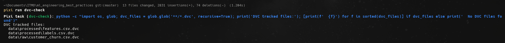
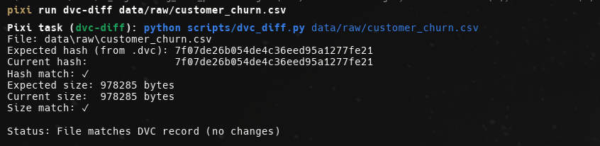
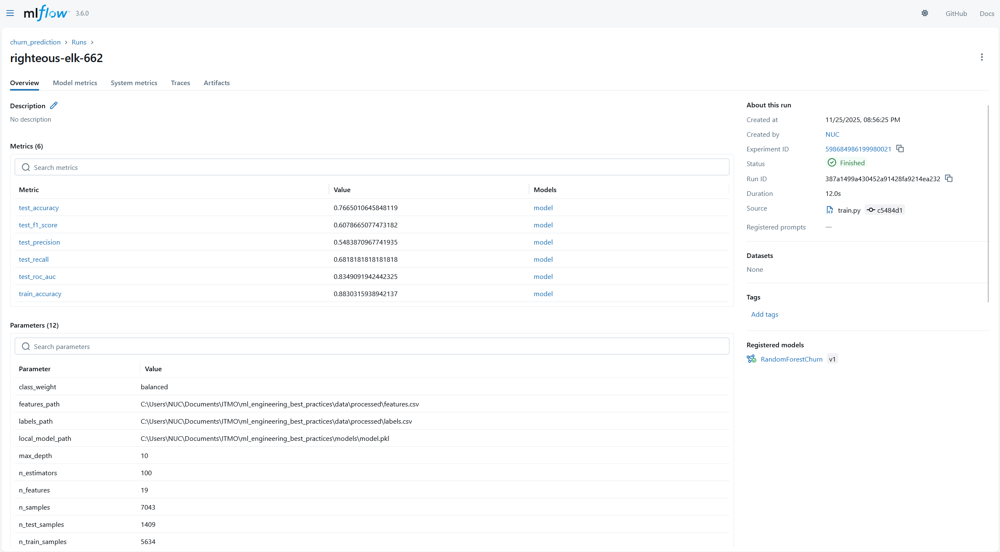
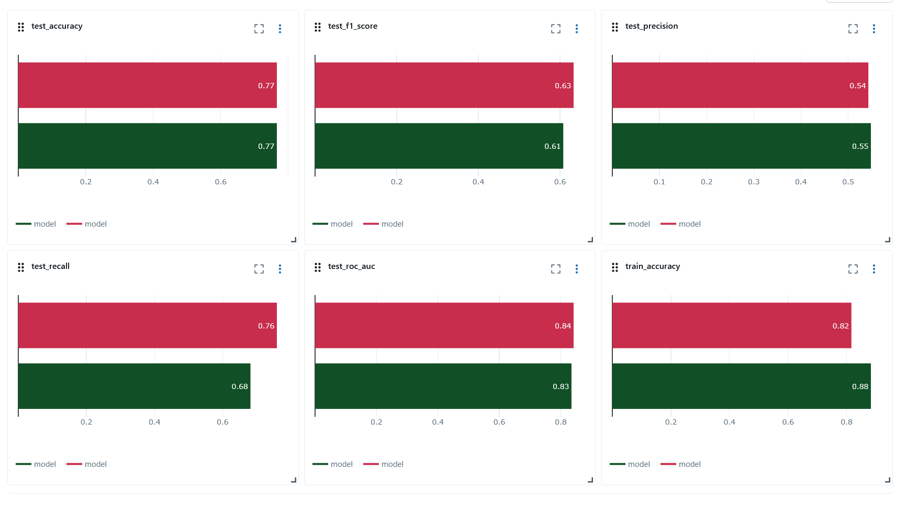
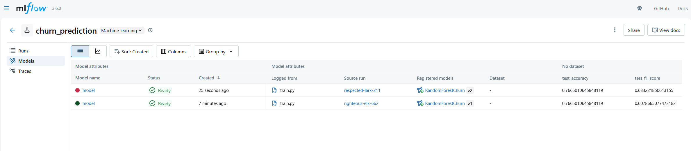
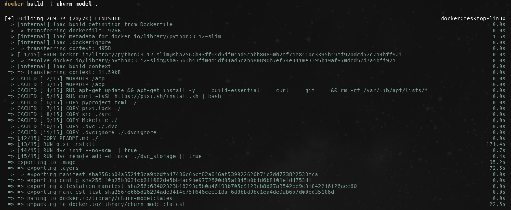
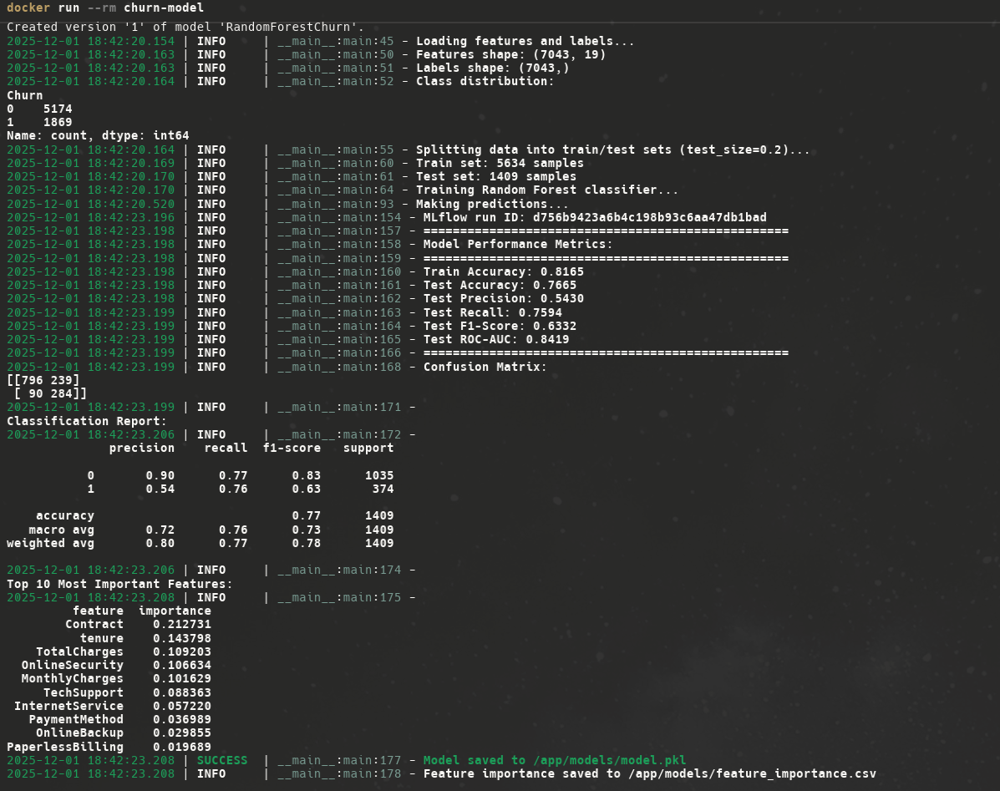

# Отчет о выполнении задания 2

## Описание проекта

Проект реализует систему версионирования данных и моделей для ML проекта предсказания оттока клиентов телекоммуникационной компании. Используются инструменты DVC (Data Version Control) для версионирования данных и MLflow для версионирования моделей.


## 1. Настройка DVC для версионирования данных

### 1.1 Установка и настройка DVC

DVC добавлен в зависимости проекта в `pyproject.toml`:
```toml
dvc = ">=3.57.0"
dvc-s3 = "==3.1.0"
```

Инициализация DVC выполняется командой:
```bash
pixi run dvc-init
# или
dvc init --no-scm
```

**Примечание:** Команда `pixi run dvc-init` безопасна для повторного запуска - она автоматически проверяет, инициализирован ли DVC, и не выдает ошибок при повторном использовании.

### 1.2 Настройка Remote Storage

Настроен локальный remote storage для DVC:

```bash
dvc remote add -d local ./dvc_storage
```

Конфигурация сохранена в `.dvc/config`:
```
['remote "local"']
    url = ./dvc_storage
    type = local
['core']
    remote = local
```

### 1.3 Система версионирования данных

Версионирование данных выполняется через прямые команды DVC:

**Версионирование данных:**
```bash
# Версионирование сырых данных
dvc add data/raw/customer_churn.csv

# Версионирование обработанных признаков
dvc add data/processed/features.csv
dvc add data/processed/labels.csv

# Или все сразу через задачу
pixi run dvc-track-data
```

**Работа с версиями:**
```bash
# Просмотр статуса
dvc status
```


```bash
# Сравнение версий
dvc diff data/raw/customer_churn.csv

# Переключение на конкретную версию
git checkout <commit> data/raw/customer_churn.csv.dvc
dvc checkout data/raw/customer_churn.csv
```



### 1.4 Автоматическое создание версий

Версионирование данных интегрировано в Makefile и pixi tasks:

```bash
# В pyproject.toml добавлены задачи:
dvc-track-data = "dvc add data/raw/customer_churn.csv data/processed/features.csv data/processed/labels.csv"
dvc-push = "dvc push"
dvc-pull = "dvc pull"
```

Версии данных сохраняются в Git через `.dvc` файлы, а сами данные хранятся в `dvc_storage/`.


## 2. Настройка MLflow для версионирования моделей

### 2.1 Установка и настройка MLflow

MLflow добавлен в зависимости:
```toml
mlflow = ">=2.19.0"
```

MLflow настроен для локального хранения:
- Tracking URI: `file:./mlruns`
- Experiment: `churn_prediction`



### 2.2 Система версионирования моделей

MLflow интегрирован в `src/modeling/train.py`:

**Логирование параметров:**
- n_estimators, max_depth, test_size, random_state
- Информация о данных (количество признаков, размер выборки)

**Логирование метрик:**
- train_accuracy
- test_accuracy, test_precision, test_recall
- test_f1_score, test_roc_auc

**Регистрация модели:**
```python
mlflow.sklearn.log_model(
    model,
    "model",
    registered_model_name="RandomForestChurn",
)
```

### 2.3 Метаданные для моделей

Каждая модель логирует:
- **Параметры модели**: гиперпараметры Random Forest
- **Метрики**: все метрики производительности
- **Артефакты**:
  - feature_importance.csv
  - confusion_matrix.csv
- **Метаданные**: пути к данным, версии зависимостей

### 2.4 Система сравнения версий

Сравнение версий моделей выполняется через MLflow UI:

**Визуальное сравнение через MLflow UI:**
```bash
pixi run mlflow-ui
# Открыть http://localhost:5000
```

В MLflow UI доступно:
- Список всех запусков эксперимента
- Таблица сравнения метрик и параметров
- Графики метрик для визуального сравнения



- Model Registry для управления версиями моделей



**Сравнение через Python API:**
```python
import mlflow

mlflow.set_tracking_uri("file:./mlruns")
runs = mlflow.search_runs(experiment_names=["churn_prediction"])
print(runs[['run_id', 'metrics.test_accuracy', 'metrics.test_f1_score']])
```

**Регистрация лучшей модели:**
```python
import mlflow

mlflow.set_tracking_uri("file:./mlruns")
runs = mlflow.search_runs(
    experiment_names=["churn_prediction"],
    order_by=["metrics.test_f1_score DESC"],
    max_results=1
)
best_run_id = runs.iloc[0]["run_id"]
mlflow.register_model(f"runs:/{best_run_id}/model", "RandomForestChurn")
```


## 3. Воспроизводимость

### 3.1 Инструкции по воспроизведению

Создан файл `docs/docs/reproducibility.md` с подробными инструкциями:
- Установка зависимостей
- Настройка Kaggle API
- Инициализация DVC
- Запуск pipeline
- Воспроизведение конкретных версий данных и моделей

### 3.2 Фиксация версий зависимостей

Все зависимости зафиксированы с точными версиями:
- **pyproject.toml** - точные версии всех зависимостей
- **pixi.lock** - зафиксированный lockfile для воспроизводимости
- **Python 3.12** - фиксированная версия Python

### 3.3 Тестирование воспроизводимости

Для проверки воспроизводимости:
1. Клонировать репозиторий
2. Установить зависимости: `pixi install`
3. Запустить pipeline: `pixi run pipeline`
4. Проверить метрики в MLflow UI

Все результаты должны совпадать благодаря фиксации:
- Версий зависимостей
- Random seed (random_state=42)
- Версий данных через DVC

### 3.4 Docker контейнер

Обновлен `Dockerfile` для поддержки DVC и MLflow:

```dockerfile
FROM python:3.12-slim
WORKDIR /app

# Установка системных зависимостей
RUN apt-get update && apt-get install -y \
    build-essential \
    curl \
    git \
    && rm -rf /var/lib/apt/lists/*

# Установка Pixi
RUN curl -fsSL https://pixi.sh/install.sh | bash
ENV PATH="/root/.pixi/bin:${PATH}"

# Копирование файлов проекта
COPY pyproject.toml pixi.lock ./
COPY src ./src
COPY Makefile ./
COPY .dvc ./.dvc
COPY .dvcignore ./.dvcignore
COPY README.md ./
# Копирование данных для обучения
COPY data ./data

# Установка зависимостей через Pixi
RUN pixi install

# Инициализация DVC
RUN dvc init --no-scm || true
RUN dvc remote add -d local ./dvc_storage || true

ENV PYTHONPATH=/app
EXPOSE 5000

# Использование pixi run для запуска в правильном окружении
CMD ["pixi", "run", "train"]
```

**Особенности реализации:**
- Данные копируются в образ при сборке для обеспечения воспроизводимости
- Используется `pixi run train` для запуска обучения в правильном Python-окружении со всеми зависимостями
- DVC инициализируется автоматически при сборке образа
- Все зависимости устанавливаются через Pixi для консистентности с локальной разработкой



**Использование:**
```bash
# Сборка образа
docker build -t churn-model .

# Запуск обучения (контейнер автоматически удаляется после выполнения)
docker run --rm churn-model

# Запуск с MLflow UI
docker run -p 5000:5000 --rm churn-model pixi run mlflow-ui
# Откройте браузер: http://localhost:5000
```



