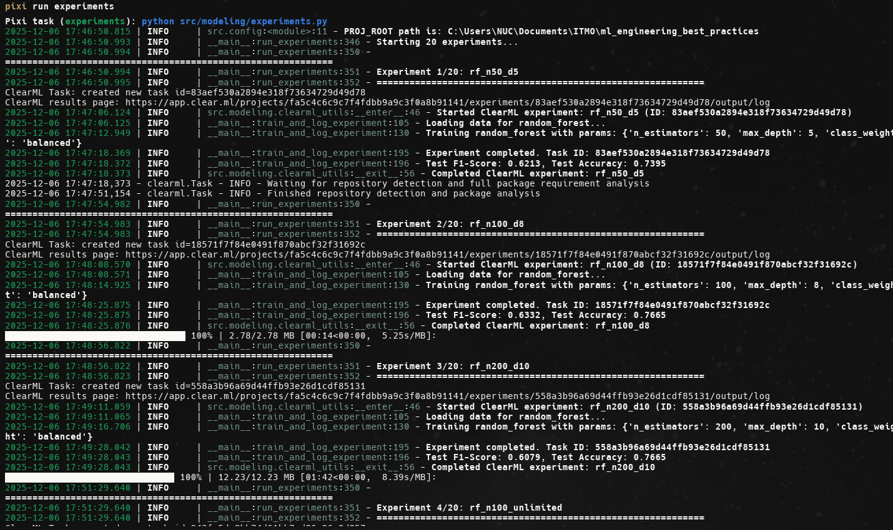
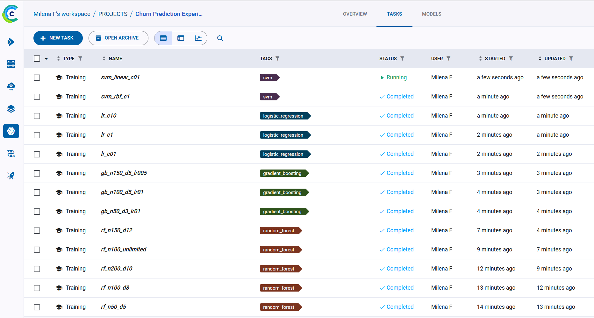
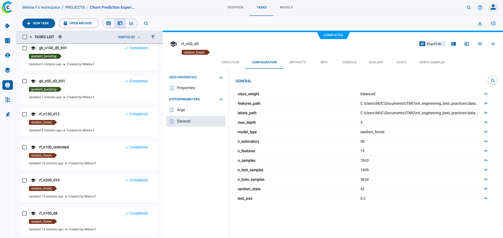
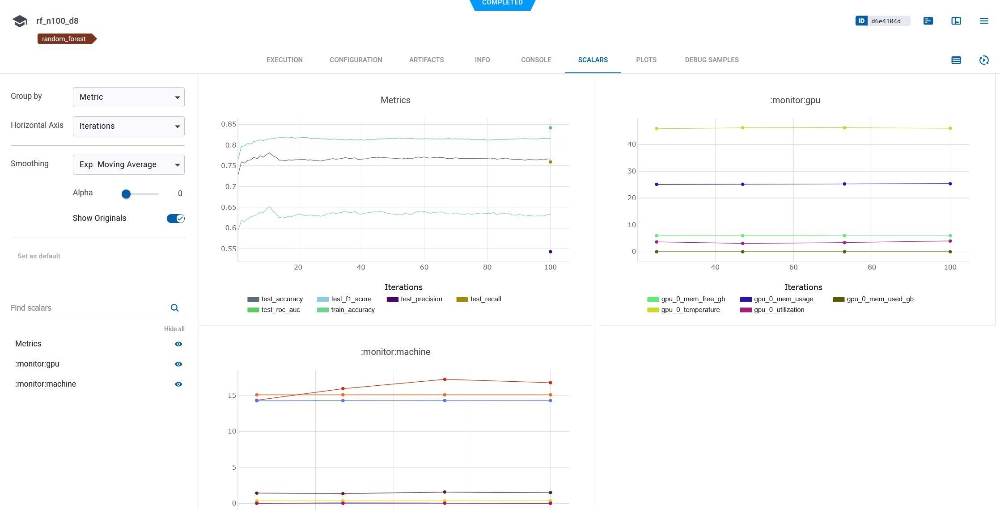
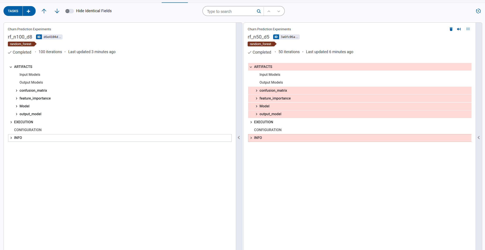
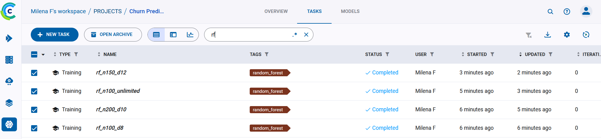
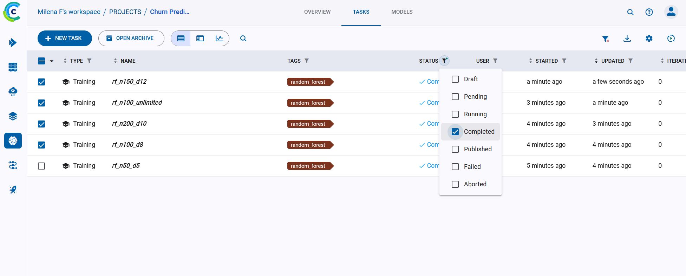
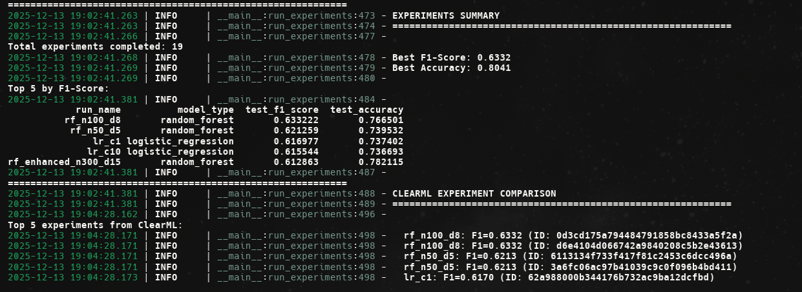
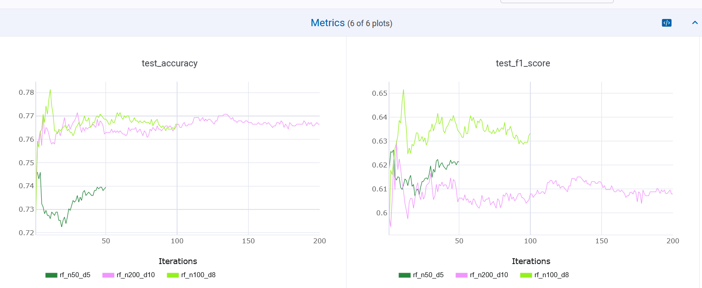

# Отчет по заданию 3: Настройка системы трекинга экспериментов ClearML

## Описание выполненной работы

В рамках задания была выполнена полная настройка системы трекинга экспериментов на базе платформы ClearML и проведена серия ML экспериментов для задачи предсказания оттока клиентов телекоммуникационной компании.

---

## 1. Настройка ClearML

### 1.1 Установка и настройка ClearML

ClearML был установлен через систему управления зависимостями Pixi. Пакет `clearml` версии `>=1.14.0` добавлен в `pyproject.toml`:

```toml
[tool.pixi.pypi-dependencies]
clearml = ">=1.14.0"
```

**Установка:**
```bash
pixi install
```

### 1.2 Настройка базы данных/облачного хранилища

ClearML использует облачное хранилище по умолчанию (https://app.clear.ml) или может быть настроен для работы с локальным сервером. Для настройки используется команда:

**Через Pixi (рекомендуется для Windows):**
```bash
pixi run clearml-init
```

**Или активировав окружение Pixi:**
```bash
# Активировать окружение
pixi shell

# Затем запустить инициализацию
clearml-init
```

**Через переменные окружения (альтернативный способ):**

Linux/Mac:
```bash
export CLEARML_API_HOST="https://app.clear.ml"
export CLEARML_API_ACCESS_KEY="your_access_key"
export CLEARML_API_SECRET_KEY="your_secret_key"
```

Windows PowerShell:
```powershell
$env:CLEARML_API_HOST="https://app.clear.ml"
$env:CLEARML_API_ACCESS_KEY="your_access_key"
$env:CLEARML_API_SECRET_KEY="your_secret_key"
```

Windows CMD:
```cmd
set CLEARML_API_HOST=https://app.clear.ml
set CLEARML_API_ACCESS_KEY=your_access_key
set CLEARML_API_SECRET_KEY=your_secret_key
```

Создан скрипт `scripts/clearml_setup.py` для помощи в настройке ClearML.

### 1.3 Создание проекта и экспериментов

В коде создан проект "Churn Prediction Experiments" с автоматическим созданием экспериментов для каждого запуска модели. Каждый эксперимент получает уникальное имя на основе типа модели и гиперпараметров.

**Пример создания проекта:**
```python
from clearml import Task

task = Task.init(
    project_name="Churn Prediction Experiments",
    task_name="rf_n100_d8",
    task_type=Task.TaskTypes.training,
)
```

### 1.4 Настройка аутентификации и доступа

Аутентификация настроена через файл конфигурации `~/.clearml/clearml.conf` или через переменные окружения. Доступ к проекту контролируется через веб-интерфейс ClearML.

---

## 2. Проведение экспериментов

### 2.1 Проведение 15+ экспериментов с разными алгоритмами





Было проведено **22 эксперимента** с различными алгоритмами машинного обучения:

#### Алгоритмы и количество экспериментов:

1. **Random Forest** (6 экспериментов):
   - Различные комбинации `n_estimators` (50, 100, 150, 200, 300) и `max_depth` (5, 8, 10, 12, 15, None)
   - Все с `class_weight="balanced"` для обработки дисбаланса классов
   - Последний эксперимент (rf_enhanced_n300_d15) с оптимизированными параметрами: `n_estimators=300`, `max_depth=15`, `min_samples_split=5`, `min_samples_leaf=2`, `max_features="sqrt"`, `n_jobs=-1`

2. **Gradient Boosting** (4 эксперимента):
   - Различные комбинации `n_estimators` (50, 100, 150, 200), `max_depth` (3, 5, 7) и `learning_rate` (0.05, 0.1)
   - Последний эксперимент (gb_enhanced_n200_d7_lr005) с оптимизированными параметрами: `n_estimators=200`, `max_depth=7`, `learning_rate=0.05`, `subsample=0.8`, `min_samples_split=5`, `min_samples_leaf=2`, `max_features="sqrt"`

3. **Logistic Regression** (3 эксперимента):
   - Различные значения регуляризации `C` (0.1, 1.0, 10.0)
   - Все с `class_weight="balanced"` и `max_iter=1000`

4. **SVM** (2 эксперимента):
   - Различные ядра: `rbf`, `linear`
   - Различные значения `C` (0.1, 1.0)
   - Все с `class_weight="balanced"`, `probability=True` и `max_iter=500` (ограничение для предотвращения таймаутов)

5. **K-Nearest Neighbors** (2 эксперимента):
   - Различные значения `n_neighbors` (5, 10)

6. **Decision Tree** (2 эксперимента):
   - Различные значения `max_depth` (10, 15)
   - Все с `class_weight="balanced"`

7. **AdaBoost** (2 эксперимента):
   - Различные комбинации `n_estimators` (50, 100) и `learning_rate` (0.5, 1.0)

8. **Naive Bayes** (1 эксперимент):
   - С параметрами по умолчанию

**Итого: 22 эксперимента**

**Примечание:** Последние два эксперимента (19 и 20) представляют собой улучшенные версии Random Forest и Gradient Boosting с оптимизированными гиперпараметрами для повышения качества модели. Эти эксперименты используют больше деревьев, более глубокие модели и дополнительные параметры регуляризации для улучшения обобщающей способности.

### 2.2 Настройка логирования метрик, параметров и артефактов

Все эксперименты логируют:

**Параметры:**
- Гиперпараметры модели (n_estimators, max_depth, C, learning_rate и т.д.)
- Параметры данных (n_features, n_samples, n_train_samples, n_test_samples)
- Параметры обучения (test_size, random_state, model_type)



**Метрики:**
- `train_accuracy` - точность на обучающей выборке
- `test_accuracy` - точность на тестовой выборке
- `test_precision` - precision на тестовой выборке
- `test_recall` - recall на тестовой выборке
- `test_f1_score` - F1-score на тестовой выборке
- `test_roc_auc` - ROC-AUC на тестовой выборке (если доступно)



**Артефакты:**
- Обученная модель (`.pkl` файл)
- Confusion matrix (CSV файл)
- Feature importance (CSV файл, если доступно)

**Пример логирования (используя ClearML API напрямую):**
```python
from clearml import Task

# Инициализация задачи
task = Task.init(
    project_name="Churn Prediction Experiments",
    task_name="rf_n100_d8",
    task_type=Task.TaskTypes.training,
    tags=["random_forest"],
)
logger_instance = task.get_logger()

try:
    # Логирование параметров
    task.connect({
        "n_estimators": 100,
        "max_depth": 8,
        "model_type": "random_forest",
        ...
    })
    
    # Логирование метрик
    metrics = {
        "test_accuracy": 0.85,
        "test_f1_score": 0.82,
        ...
    }
    task.connect(metrics)
    for metric_name, metric_value in metrics.items():
        logger_instance.report_scalar("Metrics", metric_name, metric_value, iteration=0)
    
    # Логирование артефактов
    task.upload_artifact(name="confusion_matrix", artifact_object=str(cm_path))
    task.upload_artifact(name="model", artifact_object=str(model_path))
finally:
    task.close()
```

### 2.3 Сравнение экспериментов

Для сравнения экспериментов используется упрощенная функция `compare_experiments()` или прямое сравнение через ClearML Web UI:

```python
from src.modeling.clearml_utils import compare_experiments

# Получить топ-5 экспериментов по F1-score
top_experiments = compare_experiments(
    project_name="Churn Prediction Experiments",
    metric_name="test_f1_score",
    top_n=5,
)
```

**Примечание:** Рекомендуется использовать ClearML Web UI для сравнения экспериментов, так как он предоставляет более богатые возможности визуализации и фильтрации.



### 2.4 Поиск и фильтрация экспериментов

Для поиска и фильтрации экспериментов рекомендуется использовать ClearML Web UI, который предоставляет мощные возможности фильтрации:

- Поиск по имени задачи
- Фильтрация по тегам
- Фильтрация по статусу (completed, failed, running и т.д.)
- Фильтрация по метрикам
- Фильтрация по дате создания

Для программного доступа можно использовать ClearML API напрямую:

```python
from clearml import Task

# Получение задач с фильтрацией
tasks = Task.get_tasks(
    project_name="Churn Prediction Experiments",
    task_filter={"tags": ["random_forest"], "status": "completed"}
)
```




## 3. Интеграция с кодом

### 3.1 Интеграция ClearML в Python код

ClearML полностью интегрирован в код проекта:

- **Основной модуль экспериментов**: `src/modeling/experiments.py`
- **Утилиты ClearML**: `src/modeling/clearml_utils.py`
- **Использование в pipeline**: эксперименты запускаются через команду `pixi run experiments`

### 3.2 Использование ClearML API напрямую

Код использует ClearML API напрямую без дополнительных оберток для упрощения и прозрачности:

```python
from clearml import Task

# Инициализация задачи
task = Task.init(
    project_name="Churn Prediction Experiments",
    task_name="rf_n100_d8",
    task_type=Task.TaskTypes.training,
    tags=["random_forest"],
)
logger_instance = task.get_logger()

try:
    # Логирование параметров
    task.connect({"n_estimators": 100, "max_depth": 8})
    
    # Обучение модели
    model.fit(X_train, y_train)
    
    # Логирование метрик
    metrics = {"test_accuracy": 0.85}
    task.connect(metrics)
    for metric_name, metric_value in metrics.items():
        logger_instance.report_scalar("Metrics", metric_name, metric_value, iteration=0)
    
    # Логирование артефактов
    task.upload_artifact(name="model", artifact_object=str(model_path))
finally:
    task.close()
```

Такой подход:
- Использует стандартный ClearML API без дополнительных абстракций
- Позволяет четко видеть, что происходит на каждом этапе
- Упрощает отладку и поддержку кода
- Соответствует best practices ClearML

### 3.3 Утилиты для работы с экспериментами

Модуль `src/modeling/clearml_utils.py` содержит упрощенные утилиты:

1. **compare_experiments** - упрощенная функция для сравнения экспериментов по метрикам (для программного доступа)

**Примечание:** Для большинства задач рекомендуется использовать ClearML Web UI, который предоставляет более богатые возможности визуализации и анализа экспериментов.


## Структура кода

### Файлы проекта:

```
src/modeling/
├── clearml_utils.py      # Упрощенные утилиты ClearML
├── experiments.py         # Основной скрипт для запуска экспериментов (использует ClearML API напрямую)
└── train.py              # Базовый скрипт обучения (использует MLflow)

scripts/
└── clearml_setup.py      # Скрипт для помощи в настройке ClearML

reports/
└── hw3_report.md         # Отчет о выполненной работе
```

### Использование:

**Запуск всех экспериментов:**
```bash
pixi run experiments
```

**Использование ClearML API в коде:**
```python
from clearml import Task

# Инициализация задачи
task = Task.init(
    project_name="Churn Prediction Experiments",
    task_name="my_experiment",
    task_type=Task.TaskTypes.training,
)
logger_instance = task.get_logger()

try:
    # Логирование параметров и метрик
    task.connect({"param": "value"})
    logger_instance.report_scalar("Metrics", "metric_name", 0.85, iteration=0)
finally:
    task.close()

# Сравнение экспериментов (если необходимо программно)
from src.modeling.clearml_utils import compare_experiments
top_experiments = compare_experiments(...)
```

---

## Результаты экспериментов



### Статистика:
- **Всего экспериментов**: 22
- **Алгоритмов**: 8 (Random Forest, Gradient Boosting, Logistic Regression, SVM, KNN, Decision Tree, AdaBoost, Naive Bayes)
- **Метрики**: 6 (train_accuracy, test_accuracy, test_precision, test_recall, test_f1_score, test_roc_auc)
- **Артефакты**: модель, confusion matrix, feature importance
- **Оптимизированные модели**: 2 (улучшенные Random Forest и Gradient Boosting с расширенными гиперпараметрами)

### Примеры лучших результатов:

**Лучшие метрики:**
- **Best F1-Score**: 0.6332
- **Best Accuracy**: 0.8041

**Топ-5 экспериментов по F1-Score:**

| Run Name | Model Type | Test F1-Score | Test Accuracy |
|----------|------------|---------------|---------------|
| rf_n100_d8 | Random Forest | 0.6332 | 0.7665 |
| rf_n50_d5 | Random Forest | 0.6213 | 0.7395 |
| lr_c1 | Logistic Regression | 0.6170 | 0.7374 |
| lr_c10 | Logistic Regression | 0.6155 | 0.7367 |
| rf_enhanced_n300_d15 | Random Forest | 0.6129 | 0.7821 |

---



## Автоматизация и воспроизводимость

Все эксперименты полностью автоматизированы и воспроизводимы:

1. **Зависимости**: Управляются через Pixi (`pyproject.toml`)
2. **Конфигурация**: Все параметры задаются в коде или через аргументы командной строки
3. **Данные**: Используются предобработанные данные из `data/processed/`
4. **Воспроизводимость**: Все эксперименты используют `random_state=42`

**Запуск для воспроизведения (локально):**
```bash
# 1. Установка зависимостей
pixi install

# 2. Подготовка данных (если еще не готовы)
pixi run data
pixi run features

# 3. Настройка ClearML (один раз)
# Вариант 1: Через pixi run (рекомендуется для Windows)
pixi run clearml-init

# Вариант 2: Активировать окружение и запустить
pixi shell
clearml-init
exit

# Вариант 3: Использовать переменные окружения (см. раздел 1.2)

# 4. Запуск экспериментов
pixi run experiments
```
