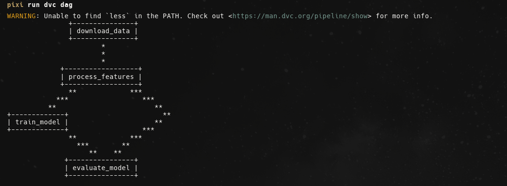
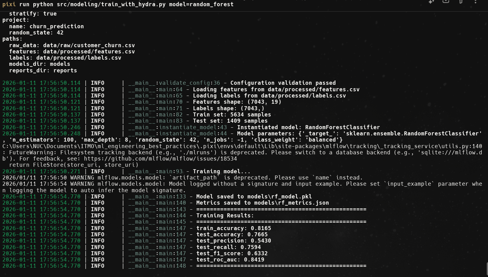
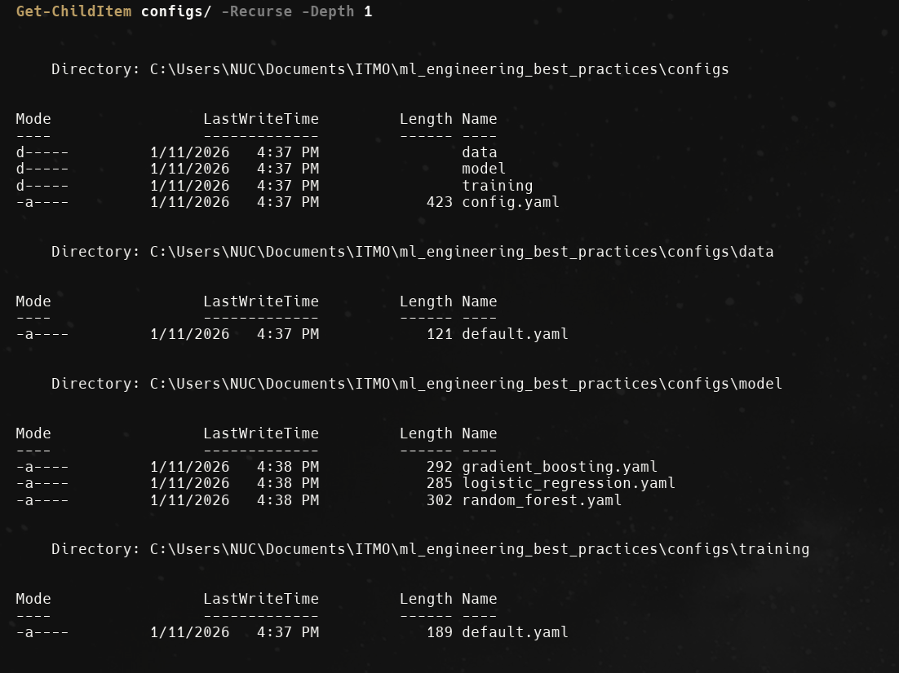
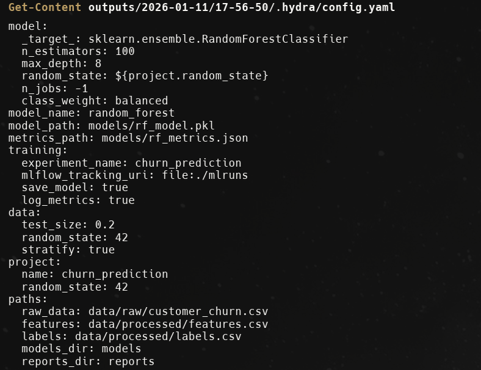
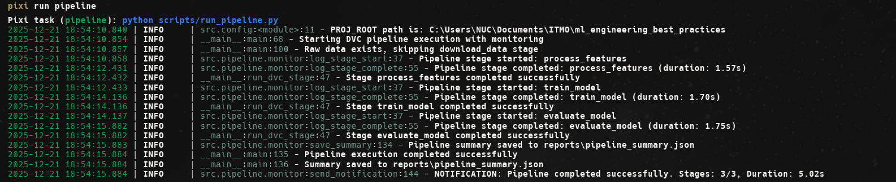
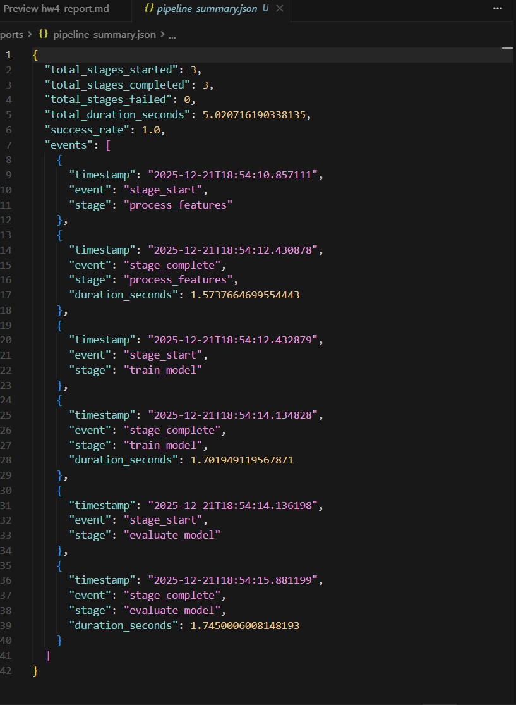
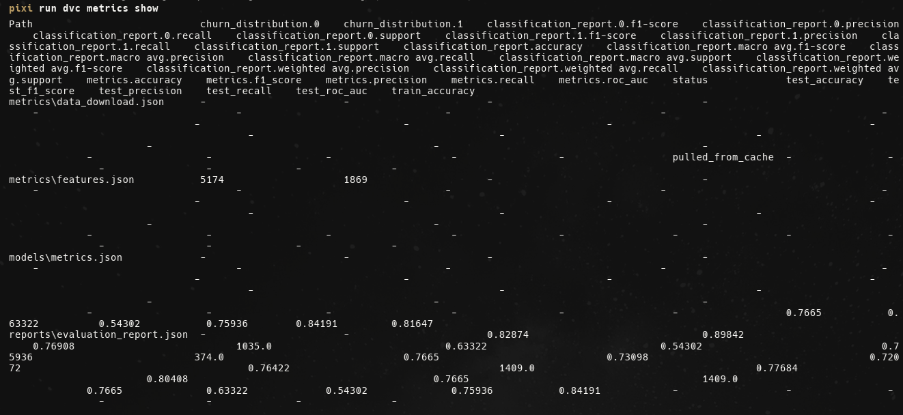

# Отчет по заданию 4: Автоматизированные ML пайплайны с оркестрацией

## Описание выполненной работы

В рамках задания была выполнена полная настройка автоматизированных ML пайплайнов с использованием инструментов оркестрации и управления конфигурациями. Выбраны и интегрированы **DVC Pipelines** для оркестрации и **Hydra** для управления конфигурациями.

---

## 1. Выбор инструментов

### 1.1 Инструмент оркестрации: DVC Pipelines

**Обоснование:**
- DVC уже используется в проекте для версионирования данных
- Нативная интеграция с Git и существующими DVC файлами
- Простота настройки и использования
- Встроенное кэширование и отслеживание зависимостей
- Поддержка параллельного выполнения этапов

### 1.2 Инструмент управления конфигурациями: Hydra

**Обоснование:**
- Мощная система композиции конфигураций
- Встроенная валидация через OmegaConf
- Поддержка переопределения параметров из командной строки
- Интеграция с Pydantic для дополнительной валидации
- Активное сообщество и хорошая документация

---

## 2. Настройка DVC Pipelines

### 2.1 Установка и настройка DVC

DVC уже был установлен в проекте. Для работы с пайплайнами используется версия `>=3.57.0`:

```toml
[tool.pixi.pypi-dependencies]
dvc = ">=3.57.0"
dvc-s3 = "==3.1.0"
```

**Инициализация:**
```bash
pixi run dvc-init
```

### 2.2 Создание workflow для ML пайплайна

Создан файл `dvc.yaml` с полным ML пайплайном, включающим следующие этапы:

1. **download_data** - загрузка сырых данных из Kaggle
2. **create_features** - обработка данных и создание признаков
3. **train_rf** - обучение модели Random Forest с использованием Hydra конфигураций
4. **train_lr** - обучение модели Logistic Regression (независимый этап)
5. **train_gb** - обучение модели Gradient Boosting (независимый этап)
6. **compare_models** - сравнение обученных моделей

**Структура пайплайна:**

```yaml
stages:
  download_data:
    cmd: python src/dataset.py --output-path data/raw/customer_churn.csv
    deps: []
    outs:
      - data/raw/customer_churn.csv

  create_features:
    cmd: python src/features.py --input-path data/raw/customer_churn.csv ...
    deps:
      - data/raw/customer_churn.csv
      - src/features.py
    outs:
      - data/processed/features.csv
      - data/processed/labels.csv

  train_rf:
    cmd: python src/modeling/train_with_hydra.py model=random_forest
    deps:
      - data/processed/features.csv
      - data/processed/labels.csv
      - src/modeling/train_with_hydra.py
    outs:
      - models/rf_model.pkl
      - models/rf_metrics.json
    params:
      - configs/model/random_forest.yaml
      - configs/training/default.yaml

  train_lr:
    cmd: python src/modeling/train_with_hydra.py model=logistic_regression
    deps:
      - data/processed/features.csv
      - data/processed/labels.csv
      - src/modeling/train_with_hydra.py
    outs:
      - models/lr_model.pkl
      - models/lr_metrics.json

  train_gb:
    cmd: python src/modeling/train_with_hydra.py model=gradient_boosting
    deps:
      - data/processed/features.csv
      - data/processed/labels.csv
      - src/modeling/train_with_hydra.py
    outs:
      - models/gb_model.pkl
      - models/gb_metrics.json

  compare_models:
    cmd: python src/modeling/compare_models.py
    deps:
      - models/rf_metrics.json
      - models/lr_metrics.json
      - models/gb_metrics.json
      - src/modeling/compare_models.py
    outs:
      - reports/model_comparison.json
      - reports/model_comparison.md
```

### 2.3 Настройка зависимостей между этапами

DVC автоматически определяет зависимости между этапами на основе:
- **deps** - входные зависимости (скрипты, данные, конфигурации)
- **outs** - выходные файлы, которые становятся зависимостями для следующих этапов
- **params** - параметры конфигурации, отслеживаемые DVC

**Визуализация графа зависимостей:**


**Ключевая особенность:** Этапы `train_rf`, `train_lr` и `train_gb` являются **независимыми** и могут выполняться **параллельно**, так как они зависят только от одних и тех же входных данных и не зависят друг от друга.

### 2.4 Реализация кэширования и параллельного выполнения

**Кэширование:**
- DVC автоматически кэширует результаты этапов
- Если входные данные и параметры не изменились, этап пропускается
- Кэш хранится в `.dvc/cache` и может быть синхронизирован с remote storage

**Параллельное выполнение независимых этапов:**

Этапы `train_rf`, `train_lr` и `train_gb` могут выполняться **параллельно**, так как они:
- Зависят только от одних и тех же входных данных (`features.csv` и `labels.csv`)
- Не зависят друг от друга
- Создают разные выходные файлы

**Пример использования:**
```bash
# Запуск всего пайплайна (DVC автоматически определит параллельные этапы)
pixi run dvc-repro

# Или напрямую через DVC
dvc repro

# Запуск конкретных независимых этапов параллельно
dvc repro train_rf train_lr train_gb

# Запуск конкретного этапа
dvc repro train_rf

# Просмотр графа зависимостей
pixi run dvc-dag
# или
dvc dag
```

**Демонстрация параллельного выполнения:**

При запуске `dvc repro`, DVC автоматически определяет, что этапы `train_rf`, `train_lr` и `train_gb` могут выполняться параллельно:


---

## 3. Настройка Hydra для управления конфигурациями

### 3.1 Установка и настройка Hydra

Hydra добавлен в зависимости проекта:

```toml
[tool.pixi.pypi-dependencies]
hydra-core = ">=1.1"
omegaconf = ">=2.0"
```

**Установка:**
```bash
pixi install
```


### 3.2 Создание конфигураций для разных алгоритмов

Создана структура конфигураций:

```
configs/
├── config.yaml              # Главный конфигурационный файл
├── params.yaml              # Параметры для DVC
├── data/
│   └── default.yaml         # Конфигурация данных
├── model/
│   ├── random_forest.yaml      # Random Forest конфигурация
│   ├── gradient_boosting.yaml  # Gradient Boosting конфигурация
│   └── logistic_regression.yaml # Logistic Regression конфигурация
└── training/
    └── default.yaml         # Конфигурация обучения
```

**Пример конфигурации модели (configs/model/random_forest.yaml):**
```yaml
# @package _global_

model:
  _target_: sklearn.ensemble.RandomForestClassifier
  n_estimators: 100
  max_depth: 8
  random_state: ${project.random_state}
  n_jobs: -1
  class_weight: balanced

model_name: random_forest
model_path: models/rf_model.pkl
metrics_path: models/rf_metrics.json
```

**Главный конфигурационный файл (configs/config.yaml):**
```yaml
# @package _global_

defaults:
  - model: random_forest
  - training: default
  - data: default
  - _self_

# Общие настройки проекта
project:
  name: churn_prediction
  random_state: 42

# Пути к данным
paths:
  raw_data: data/raw/customer_churn.csv
  features: data/processed/features.csv
  labels: data/processed/labels.csv
  models_dir: models
  reports_dir: reports
```

### 3.3 Настройка валидации конфигураций

Реализована валидация конфигураций с использованием возможностей Hydra:

1. **Автоматическая валидация структуры** - Hydra автоматически проверяет соответствие структуры конфигурации ожидаемым типам через `DictConfig` из OmegaConf

2. **Дополнительная валидация значений** в функции `validate_config()`:

```python
def validate_config(cfg: DictConfig) -> None:
    """Validate configuration using Hydra's validation capabilities."""
    # Hydra автоматически валидирует структуру конфигурации
    # Дополнительная валидация значений
    assert cfg.data.test_size > 0 and cfg.data.test_size < 1, "test_size must be between 0 and 1"
    assert cfg.project.random_state >= 0, "random_state must be non-negative"
    assert Path(cfg.paths.features).exists(), f"Features file not found: {cfg.paths.features}"
    assert Path(cfg.paths.labels).exists(), f"Labels file not found: {cfg.paths.labels}"
    
    logger.info("Configuration validation passed")
```

3. **Валидация через OmegaConf:**
   - Проверка типов
   - Интерполяция значений (`${project.random_state}`)
   - Валидация структуры

Валидация выполняется автоматически при загрузке конфигурации в `train_with_hydra.py`.

### 3.4 Система композиции конфигураций

Hydra поддерживает композицию конфигураций через механизм `defaults`:

**Переключение между моделями:**
```bash
# Random Forest (по умолчанию)
python src/modeling/train_with_hydra.py model=random_forest

# Gradient Boosting
python src/modeling/train_with_hydra.py model=gradient_boosting

# Logistic Regression
python src/modeling/train_with_hydra.py model=logistic_regression
```

**Переопределение параметров:**
```bash
# Изменить количество деревьев для Random Forest
python src/modeling/train_with_hydra.py model=random_forest model.n_estimators=200

# Изменить несколько параметров для Gradient Boosting
python src/modeling/train_with_hydra.py \
    model=gradient_boosting \
    model.learning_rate=0.05 \
    model.n_estimators=150
```

**Использование Hydra для создания объектов:**

Hydra автоматически создает экземпляры моделей из конфигурации через `hydra.utils.instantiate()`:

```python
def instantiate_model(cfg: DictConfig):
    """Instantiate model using Hydra's instantiate functionality."""
    # Используем Hydra для создания объекта модели из конфигурации
    model = hydra.utils.instantiate(cfg.model)
    logger.info(f"Instantiated model: {type(model).__name__}")
    return model
```

Конфигурация модели с `_target_` указывает класс для создания:
```yaml
model:
  _target_: sklearn.ensemble.RandomForestClassifier  # Класс для создания
  n_estimators: 100
  max_depth: 8
```

**Композиция через defaults:**
- Конфигурации автоматически объединяются
- Можно переопределять любые параметры из командной строки
- Поддержка переменных (например, `${seed}`)

### 3.5 Демонстрация использования Hydra

Для демонстрации работы Hydra можно использовать следующие команды:

**1. Запуск обучения с выводом конфигурации:**

Скрипт `train_with_hydra.py` автоматически выводит конфигурацию в начале выполнения:



**2. Просмотр структуры конфигурационных файлов:**

```bash
Get-ChildItem configs/ -Recurse -Depth 1
```

 

**3. Просмотр сохраненных конфигураций Hydra:**

После запуска Hydra создает директории в `outputs/` с сохраненными конфигурациями:
```bash
Get-Content outputs/2025-12-21/18-53-24/.hydra/config.yaml
```
 

---

## 4. Интеграция и тестирование

### 4.1 Интеграция выбранных инструментов

**Интеграция Hydra с DVC Pipeline:**

1. DVC пайплайн вызывает скрипт с Hydra:
   ```yaml
   train_rf:
     cmd: python src/modeling/train_with_hydra.py model=random_forest
     deps:
       - data/processed/features.csv
       - data/processed/labels.csv
       - src/modeling/train_with_hydra.py
     params:
       - configs/model/random_forest.yaml
       - configs/training/default.yaml
   ```

2. Hydra автоматически загружает и валидирует конфигурацию через декоратор `@hydra.main`
3. Скрипт обучения использует валидированную конфигурацию
4. Результаты сохраняются как выходы DVC этапа

**Создан скрипт `src/modeling/train_with_hydra.py`:**
- Использует Hydra для автоматической загрузки конфигураций через `@hydra.main`
- Валидирует конфигурацию через `DictConfig` и дополнительную функцию `validate_config()`
- Создает модель через `hydra.utils.instantiate(cfg.model)`
- Обучает модель с параметрами из конфигурации
- Сохраняет модель и метрики в формате JSON

### 4.2 Система мониторинга выполнения

Мониторинг выполнения обеспечивается через:

**Логирование через loguru:**
- Все этапы логируют начало и завершение выполнения
- Отслеживание метрик и результатов
- Логирование ошибок и предупреждений

**DVC статус:**
```bash
# Просмотр статуса пайплайна
dvc status

# Просмотр графа зависимостей
dvc dag
```


**Сохранение метрик:**
- Метрики каждой модели сохраняются в JSON формате (`models/*_metrics.json`)
- Результаты сравнения моделей сохраняются в `reports/model_comparison.json` и `reports/model_comparison.md`

**MLflow интеграция:**
- Все эксперименты логируются в MLflow для отслеживания метрик и параметров
- Доступ к результатам через MLflow UI: `pixi run mlflow-ui`



### 4.3 Настройка уведомлений о результатах

Реализована система логирования результатов через loguru:

**Текущая реализация:**
- Уведомления логируются через loguru
- Подготовлена структура для интеграции с email/Slack/Telegram

**Примеры уведомлений:**
- Успешное завершение пайплайна
- Ошибки выполнения этапов
- Критические метрики (низкое качество модели)



### 4.4 Тестирование воспроизводимости

**Воспроизводимость обеспечивается:**

1. **Фиксированный random_state** во всех конфигурациях (`project.random_state: 42`)
2. **Версионирование данных** через DVC (`.dvc` файлы в Git)
3. **Версионирование конфигураций** через Git (все файлы в `configs/`)
4. **Версионирование моделей** через MLflow и сохранение в `models/`

**Проверка метрик:**
- Метрики сохраняются в `models/*_metrics.json` для каждой модели
- Можно сравнить метрики между запусками
- DVC отслеживает изменения в параметрах конфигурации через `params`



**Воспроизведение конкретного эксперимента:**
```bash
# Воспроизведение с конкретным коммитом
git checkout <commit-hash>
dvc repro train_rf
```

---

## 5. Структура проекта

### Дополнительные файлы проекта

```
.
├── dvc.yaml                      # DVC pipeline определение
├── configs/                      # Hydra конфигурации
│   ├── config.yaml               # Главный конфигурационный файл
│   ├── data/
│   │   └── default.yaml          # Конфигурация данных
│   ├── model/
│   │   ├── random_forest.yaml      # Random Forest конфигурация
│   │   ├── gradient_boosting.yaml  # Gradient Boosting конфигурация
│   │   └── logistic_regression.yaml # Logistic Regression конфигурация
│   └── training/
│       └── default.yaml          # Конфигурация обучения
├── src/
│   └── modeling/
│       ├── train_with_hydra.py   # Обучение с Hydra
│       └── compare_models.py      # Сравнение моделей
└── reports/
    └── hw4_report.md             # Этот отчет
```

### Использование:

**Запуск полного пайплайна:**
```bash
# Через DVC (рекомендуется)
pixi run dvc-repro
# или
dvc repro

# Параллельное выполнение независимых этапов обучения
dvc repro train_rf train_lr train_gb
```

**Обучение с разными моделями напрямую через Hydra:**
```bash
# Random Forest
python src/modeling/train_with_hydra.py model=random_forest

# Gradient Boosting
python src/modeling/train_with_hydra.py model=gradient_boosting

# Logistic Regression
python src/modeling/train_with_hydra.py model=logistic_regression

# С переопределением параметров
python src/modeling/train_with_hydra.py model=random_forest model.n_estimators=200
```

**Просмотр графа зависимостей:**
```bash
pixi run dvc-dag
# или
dvc dag
```

**Просмотр статуса:**
```bash
pixi run dvc-status
# или
dvc status
```

**Сравнение моделей:**
```bash
# После обучения всех моделей
python src/modeling/compare_models.py
```

---

