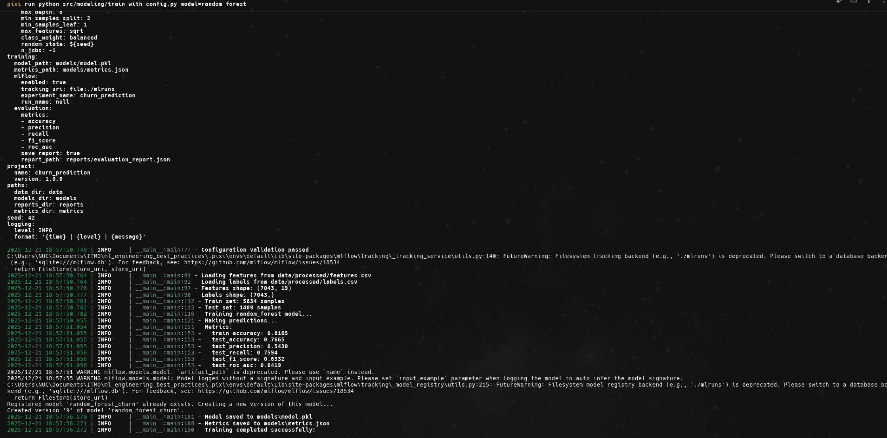

# Отчет по заданию 4: Автоматизированные ML пайплайны с оркестрацией

## Описание выполненной работы

В рамках задания была выполнена полная настройка автоматизированных ML пайплайнов с использованием инструментов оркестрации и управления конфигурациями. Выбраны и интегрированы **DVC Pipelines** для оркестрации и **Hydra** для управления конфигурациями.

---

## 1. Выбор инструментов

### 1.1 Инструмент оркестрации: DVC Pipelines

**Обоснование:**
- DVC уже используется в проекте для версионирования данных
- Нативная интеграция с Git и существующими DVC файлами
- Простота настройки и использования
- Встроенное кэширование и отслеживание зависимостей
- Поддержка параллельного выполнения этапов

### 1.2 Инструмент управления конфигурациями: Hydra

**Обоснование:**
- Мощная система композиции конфигураций
- Встроенная валидация через OmegaConf
- Поддержка переопределения параметров из командной строки
- Интеграция с Pydantic для дополнительной валидации
- Активное сообщество и хорошая документация

---

## 2. Настройка DVC Pipelines

### 2.1 Установка и настройка DVC

DVC уже был установлен в проекте. Для работы с пайплайнами используется версия `>=3.57.0`:

```toml
[tool.pixi.pypi-dependencies]
dvc = ">=3.57.0"
dvc-s3 = "==3.1.0"
```

**Инициализация:**
```bash
pixi run dvc-init
```

### 2.2 Создание workflow для ML пайплайна

Создан файл `dvc.yaml` с полным ML пайплайном, включающим следующие этапы:

1. **download_data** - загрузка сырых данных
2. **process_features** - обработка данных и создание признаков
3. **train_model** - обучение модели с использованием Hydra конфигураций
4. **evaluate_model** - оценка качества модели


**Структура пайплайна:**

```yaml
stages:
  download_data:
    cmd: python src/dataset.py --output-path data/raw/customer_churn.csv
    deps:
      - src/dataset.py
      - src/config.py
    outs:
      - data/raw/customer_churn.csv
    params:
      - configs/params.yaml:config
    metrics:
      - metrics/data_download.json

  process_features:
    cmd: python src/features.py ...
    deps:
      - src/features.py
      - data/raw/customer_churn.csv
    outs:
      - data/processed/features.csv
      - data/processed/labels.csv

  train_model:
    cmd: python src/modeling/train_with_config.py model=random_forest
    deps:
      - src/modeling/train_with_config.py
      - data/processed/features.csv
      - configs/config.yaml
      - configs/model/random_forest.yaml
    outs:
      - models/model.pkl
      - models/metrics.json

  evaluate_model:
    cmd: python src/modeling/evaluate.py ...
    deps:
      - models/model.pkl
      - data/processed/features.csv
    outs:
      - reports/evaluation_report.json
```

### 2.3 Настройка зависимостей между этапами

DVC автоматически определяет зависимости между этапами на основе:
- **deps** - входные зависимости (скрипты, данные, конфигурации)
- **outs** - выходные файлы, которые становятся зависимостями для следующих этапов

Порядок выполнения определяется автоматически:
```
download_data → process_features → train_model → evaluate_model
```

### 2.4 Реализация кэширования и параллельного выполнения

**Кэширование:**
- DVC автоматически кэширует результаты этапов
- Если входные данные и параметры не изменились, этап пропускается
- Кэш хранится в `.dvc/cache` и может быть синхронизирован с remote storage

**Параллельное выполнение:**
- DVC поддерживает параллельное выполнение независимых этапов
- Можно запустить несколько моделей параллельно:
  ```bash
  dvc repro train_model -f train_model@random_forest train_model@gradient_boosting
  ```

**Пример использования:**
```bash
# Запуск всего пайплайна
pixi run dvc-repro

# Запуск конкретного этапа
dvc repro train_model

# Запуск с переопределением параметров
dvc repro train_model -S model.params.n_estimators=200

# Просмотр графа зависимостей
pixi run dvc-dag
```

---

## 3. Настройка Hydra для управления конфигурациями

### 3.1 Установка и настройка Hydra

Hydra добавлен в зависимости проекта:

```toml
[tool.pixi.pypi-dependencies]
hydra-core = ">=1.3.0"
omegaconf = ">=2.3.0"
pydantic = ">=2.0.0"
```


### 3.2 Создание конфигураций для разных алгоритмов

Создана структура конфигураций:

```
configs/
├── config.yaml              # Главный конфигурационный файл
├── params.yaml              # Параметры для DVC
├── data/
│   └── default.yaml         # Конфигурация данных
├── model/
│   ├── random_forest.yaml      # Random Forest конфигурация
│   ├── gradient_boosting.yaml  # Gradient Boosting конфигурация
│   └── logistic_regression.yaml # Logistic Regression конфигурация
└── training/
    └── default.yaml         # Конфигурация обучения
```

**Пример конфигурации модели (configs/model/random_forest.yaml):**
```yaml
model:
  name: random_forest
  type: RandomForestClassifier
  params:
    n_estimators: 100
    max_depth: 8
    min_samples_split: 2
    min_samples_leaf: 1
    max_features: "sqrt"
    class_weight: "balanced"
    random_state: ${seed}
    n_jobs: -1
```

**Главный конфигурационный файл (configs/config.yaml):**
```yaml
defaults:
  - data: default
  - model: random_forest
  - training: default
  - _self_

project:
  name: churn_prediction
  version: 1.0.0

seed: 42

logging:
  level: INFO
  format: "{time} | {level} | {message}"
```

### 3.3 Настройка валидации конфигураций

Реализована валидация конфигураций через **Pydantic** схемы (`src/modeling/config_schema.py`):

```python
class ModelConfig(BaseModel):
    """Model configuration schema."""
    name: str
    type: str
    params: Dict[str, Any]

    @validator("type")
    def validate_model_type(cls, v):
        allowed_types = [
            "RandomForestClassifier",
            "GradientBoostingClassifier",
            "LogisticRegression",
        ]
        if v not in allowed_types:
            raise ValueError(f"Model type must be one of {allowed_types}")
        return v
```

Валидация выполняется автоматически при загрузке конфигурации в `train_with_config.py`.

### 3.4 Система композиции конфигураций

Hydra поддерживает композицию конфигураций через механизм `defaults`:

**Переключение между моделями:**
```bash
# Random Forest (по умолчанию)
python src/modeling/train_with_config.py

# Gradient Boosting
python src/modeling/train_with_config.py model=gradient_boosting

# Logistic Regression
python src/modeling/train_with_config.py model=logistic_regression
```


**Переопределение параметров:**
```bash
# Изменить количество деревьев
python src/modeling/train_with_config.py model.params.n_estimators=200

# Изменить несколько параметров
python src/modeling/train_with_config.py \
    model=gradient_boosting \
    model.params.learning_rate=0.05 \
    model.params.n_estimators=150
```

**Композиция через defaults:**
- Конфигурации автоматически объединяются
- Можно переопределять любые параметры из командной строки
- Поддержка переменных (например, `${seed}`)

---

## 4. Интеграция и тестирование

### 4.1 Интеграция выбранных инструментов

**Интеграция Hydra с DVC Pipeline:**

1. DVC пайплайн вызывает скрипт с Hydra:
   ```yaml
   train_model:
     cmd: python src/modeling/train_with_config.py model=random_forest
     deps:
       - configs/config.yaml
       - configs/model/random_forest.yaml
   ```

2. Hydra загружает и валидирует конфигурацию
3. Скрипт обучения использует валидированную конфигурацию
4. Результаты сохраняются как выходы DVC этапа

**Создан скрипт `src/modeling/train_with_config.py`:**
- Использует Hydra для загрузки конфигураций
- Валидирует конфигурацию через Pydantic
- Обучает модель с параметрами из конфигурации
- Сохраняет модель и метрики

### 4.2 Система мониторинга выполнения

Создана система мониторинга (`src/pipeline/monitor.py`):

**Функциональность:**
- Логирование начала и завершения этапов
- Отслеживание длительности выполнения
- Логирование ошибок
- Сохранение метрик
- Генерация сводки выполнения

**Использование:**
```python
from src.pipeline.monitor import PipelineMonitor

monitor = PipelineMonitor()
monitor.log_stage_start("train_model")
monitor.log_stage_complete("train_model", duration=120.5)
monitor.log_metrics("train_model", {"f1_score": 0.85})
```

**Скрипт запуска пайплайна с мониторингом:**
```bash
pixi run pipeline
```


Скрипт `scripts/run_pipeline.py` автоматически:
- Запускает все этапы DVC пайплайна
- Мониторит выполнение каждого этапа
- Сохраняет сводку в `reports/pipeline_summary.json`


### 4.3 Настройка уведомлений о результатах

Реализована система уведомлений в `src/pipeline/monitor.py`:

```python
def send_notification(message: str, level: str = "info"):
    """Send notification (placeholder for future integration)."""
    logger.log(level.upper(), f"NOTIFICATION: {message}")
    # Future: integrate with email, Slack, etc.
```

**Текущая реализация:**
- Уведомления логируются через loguru
- Подготовлена структура для интеграции с email/Slack/Telegram

**Примеры уведомлений:**
- Успешное завершение пайплайна
- Ошибки выполнения этапов
- Критические метрики (низкое качество модели)

### 4.4 Тестирование воспроизводимости

**Воспроизводимость обеспечивается:**

1. **Фиксированный random_state** во всех конфигурациях
2. **Версионирование данных** через DVC
3. **Версионирование конфигураций** через Git
4. **Версионирование моделей** через MLflow


**Проверка метрик:**
- Метрики сохраняются в `models/metrics.json`
- Можно сравнить метрики между запусками
- DVC отслеживает изменения метрик


---

## 5. Структура проекта

### Дополнительные файлы проекта

```
.
├── dvc.yaml                      # DVC pipeline определение
├── configs/                      # Hydra конфигурации
│   ├── config.yaml
│   ├── params.yaml
│   ├── data/
│   │   └── default.yaml
│   ├── model/
│   │   ├── random_forest.yaml
│   │   ├── gradient_boosting.yaml
│   │   └── logistic_regression.yaml
│   └── training/
│       └── default.yaml
├── src/
│   ├── modeling/
│   │   ├── train_with_config.py  # Обучение с Hydra
│   │   ├── evaluate.py           # Оценка модели
│   │   └── config_schema.py      # Pydantic схемы валидации
│   └── pipeline/
│       └── monitor.py            # Система мониторинга
└── scripts/
    └── run_pipeline.py           # Запуск пайплайна с мониторингом
```

### Использование:

**Запуск полного пайплайна:**
```bash
pixi run pipeline
```

**Запуск через DVC напрямую:**
```bash
pixi run dvc-repro
```


**Обучение с разными моделями:**
```bash
# Random Forest
python src/modeling/train_with_config.py model=random_forest

# Gradient Boosting
python src/modeling/train_with_config.py model=gradient_boosting

# Logistic Regression
python src/modeling/train_with_config.py model=logistic_regression
```

**Просмотр графа зависимостей:**
```bash
pixi run dvc-dag
```

**Мониторинг выполнения:**
```bash
pixi run pipeline-monitor
```

---

## 6. Результаты

### Достигнутые возможности:

1. ✅ **Полная автоматизация ML пайплайна** через DVC
2. ✅ **Гибкое управление конфигурациями** через Hydra
3. ✅ **Валидация конфигураций** через Pydantic
4. ✅ **Кэширование и оптимизация** выполнения через DVC
5. ✅ **Мониторинг выполнения** пайплайна
6. ✅ **Воспроизводимость** результатов

### Преимущества реализации:

- **Модульность**: Каждый этап независим и может быть переиспользован
- **Гибкость**: Легко добавлять новые модели и этапы
- **Надежность**: Автоматическая валидация и отслеживание зависимостей
- **Эффективность**: Кэширование и параллельное выполнение
- **Прозрачность**: Полное логирование и мониторинг

---

## 7. Воспроизводимость

Для воспроизведения результатов:

```bash
# 1. Установка зависимостей
pixi install

# 2. Инициализация DVC (если еще не инициализирован)
pixi run dvc-init

# 3. Запуск пайплайна
pixi run pipeline

# Или через DVC напрямую
pixi run dvc-repro
```

Все конфигурации версионируются через Git, данные через DVC, что обеспечивает полную воспроизводимость результатов.
