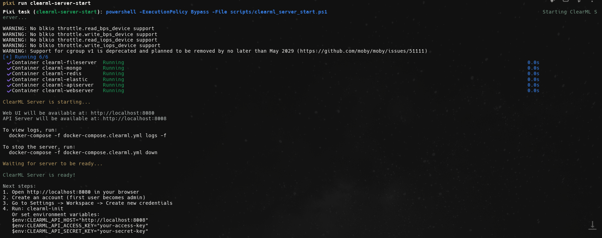
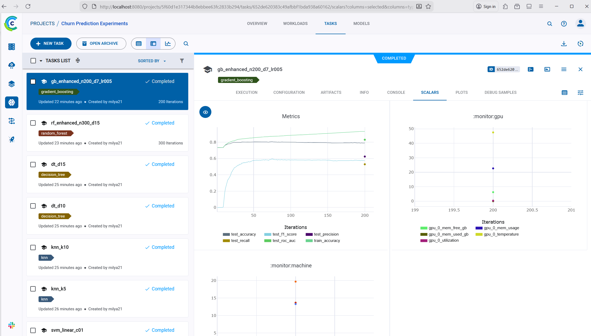
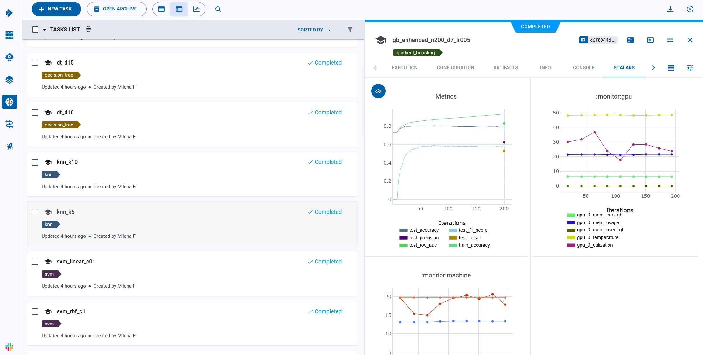
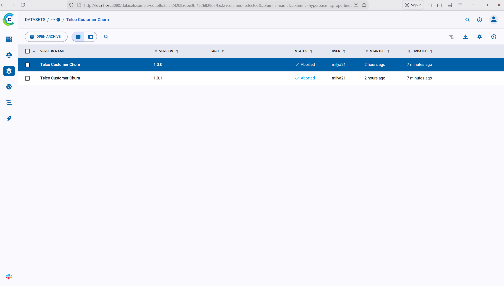
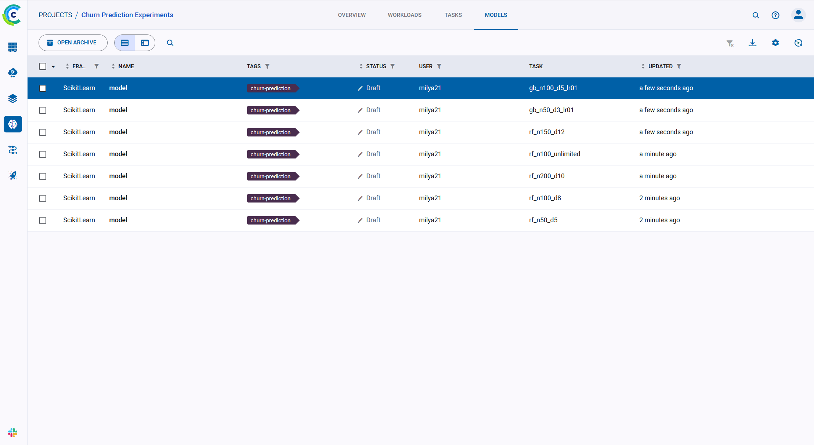
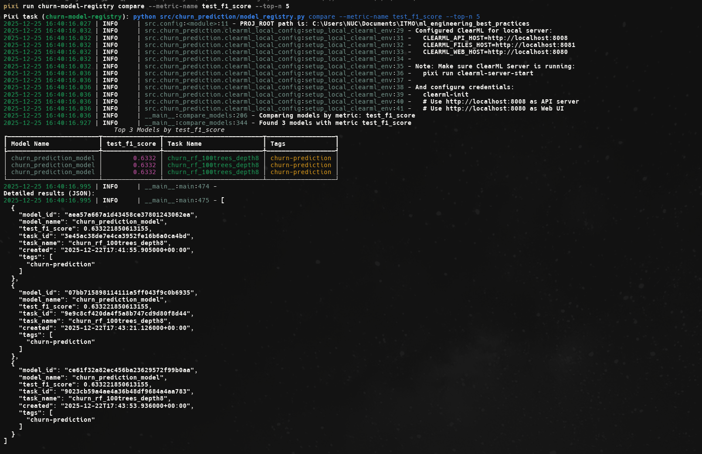
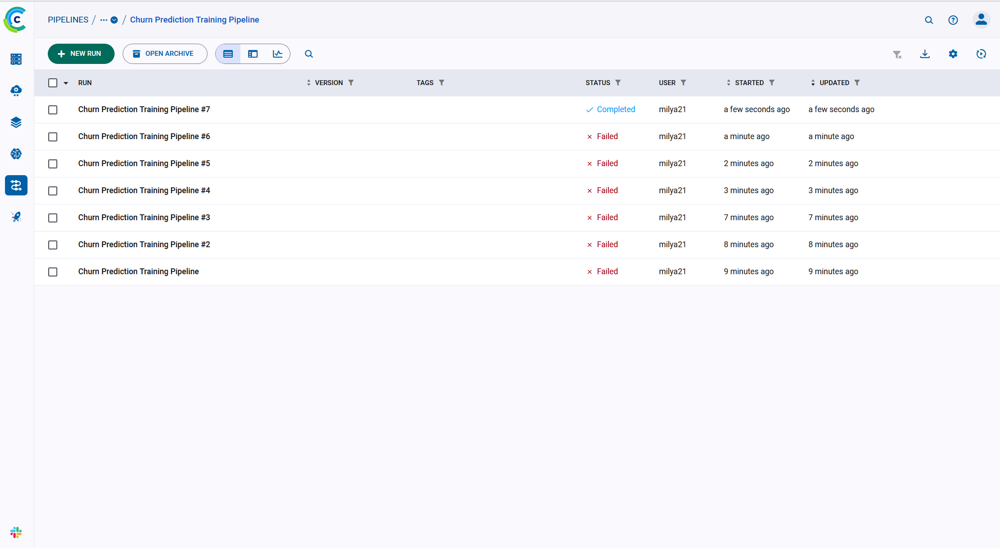
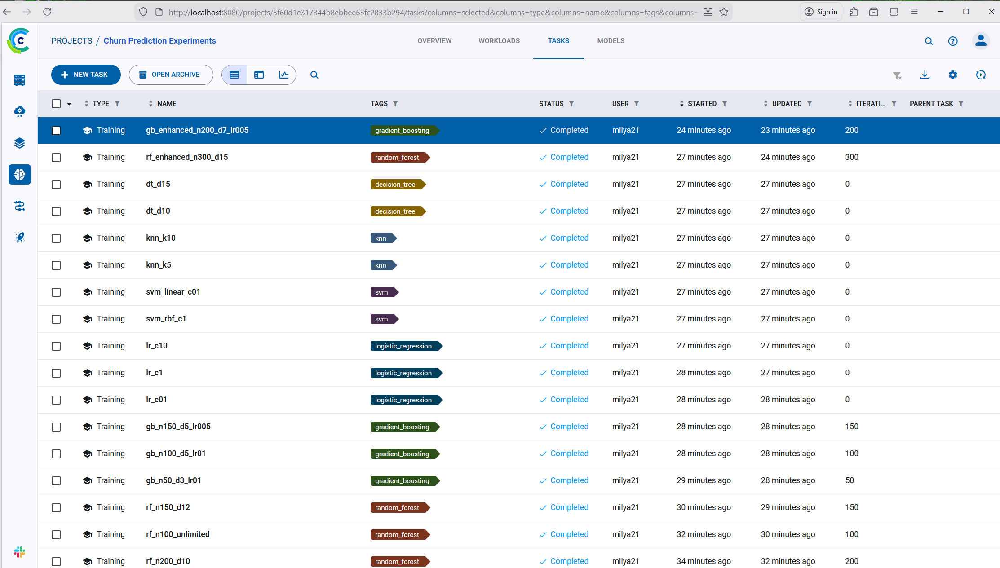

# ClearML для комплексного MLOps

## Описание задания

Настройка полного MLOps workflow с использованием ClearML для проекта предсказания оттока клиентов телекоммуникационной компании.


## 1. Подготовка проекта

### 1.1 Скачивание датасета

Создан скрипт `src/dataset.py` для загрузки датасета Telco Customer Churn с Kaggle. Датасет содержит информацию о клиентах телекоммуникационной компании и их статусе оттока (Churn: Yes/No).

**Реализация:**
- Использование Kaggle API для загрузки датасета
- Автоматическая обработка и сохранение данных
- Поддержка различных способов аутентификации (kaggle.json, переменные окружения)

**Датасет:**
- Источник: [Kaggle - Telco Customer Churn](https://www.kaggle.com/datasets/blastchar/telco-customer-churn)
- Размер: ~7000 записей
- Признаки: демографические данные, информация об услугах, контрактах, платежах
- Целевая переменная: Churn (Yes/No)

### 1.2 Создание ML проекта с предсказанием оттока клиентов

Создан полноценный проект для предсказания оттока клиентов со следующей структурой:

```
src/
├── churn_prediction/
│   ├── __init__.py
│   ├── config.py                    # Конфигурация проекта
│   ├── data_versioning.py           # Версионирование данных
│   ├── model_registry.py            # Регистрация моделей
│   └── pipeline.py                  # Пайплайны обучения и деплоя
├── modeling/
│   ├── train.py                     # Обучение модели с ClearML
│   ├── experiments.py               # Запуск множественных экспериментов
│   └── clearml_utils.py             # Утилиты ClearML
├── dataset.py                        # Загрузка датасета
└── features.py                       # Создание признаков
```

**Особенности реализации:**
- Использование классических ML моделей (Random Forest, Gradient Boosting, Logistic Regression и др.)
- Обработка категориальных и числовых признаков
- Обработка дисбаланса классов
- Автоматическое логирование в ClearML

### 1.3 Подготовка конфигураций для разных этапов

Конфигурация проекта централизована в `src/churn_prediction/config.py`:
- Настройки путей к данным и моделям
- Параметры датасета
- Настройки модели и обучения
- Настройки ClearML проекта

Все параметры задаются программно через класс `ChurnPredictionConfig`, что упрощает управление конфигурацией и интеграцию с ClearML.

## 2. Настройка ClearML

### 2.1 Установка ClearML Server локально



Для локальной установки ClearML Server созданы готовые скрипты и docker-compose конфигурация:

**Вариант 1: Использование готовых скриптов (был использован в рамках проекта)**

**Windows (PowerShell):**
```powershell
pixi run clearml-server-start
# или напрямую
.\scripts\clearml_server_start.ps1
```

**Linux/Mac:**
```bash
pixi run clearml-server-start-unix
# или напрямую
bash scripts/clearml_server_start.sh
```

**Вариант 2: Использование Docker Compose напрямую**

```bash
docker compose -f docker-compose.clearml.yml up -d
```

**После запуска сервера:**
- Web UI доступен по адресу: http://localhost:8080
- API Server доступен по адресу: http://localhost:8008

**Альтернатива**: Использование облачного сервера ClearML (https://app.clear.ml) для быстрого старта без локальной установки.

### 2.2 Настройка базы данных и хранилища

ClearML Server автоматически настраивает:
- **MongoDB** для хранения метаданных экспериментов
- **Elasticsearch** для поиска и фильтрации
- **Redis** для кэширования
- **File Server** для хранения артефактов (модели, датасеты, логи)

Для локальной установки все компоненты запускаются в Docker контейнере.

### 2.3 Создание проекта и экспериментов

Создан проект "Churn Prediction" в ClearML. Все эксперименты автоматически логируются в этот проект.

**Реализация:**
- Использование ClearML API напрямую (`Task.init()`) для управления экспериментами
- Автоматическое создание задач при запуске обучения
- Логирование всех параметров, метрик и артефактов через стандартные методы ClearML

### 2.4 Настройка аутентификации и прав доступа

Настроена аутентификация через:
- Конфигурационный файл (`~/.clearml/clearml.conf`)
- Переменные окружения (`CLEARML_API_ACCESS_KEY`, `CLEARML_API_SECRET_KEY`)

Создан скрипт `scripts/clearml_setup.py` для помощи в настройке.

## 3. Система трекинга экспериментов

### 3.1 Настройка автоматического логирования





Реализовано автоматическое логирование:

**Параметры:**
- Гиперпараметры модели (n_estimators, max_depth, learning_rate и т.д.)
- Параметры данных (test_size, random_state, n_features)
- Системная информация (random_state, model_type)

**Метрики:**
- Метрики обучения (train_accuracy)
- Метрики валидации (test_accuracy, test_precision, test_recall, test_f1_score, test_roc_auc)
- Метрики в реальном времени во время обучения

**Артефакты:**
- Обученные модели
- Confusion matrix (как таблица и изображение)
- Feature importance
- Classification report
- Логи обучения

**Код и окружение:**
- Автоматическое версионирование кода
- Отслеживание зависимостей (requirements.txt)
- Системная информация (OS, Python version, GPU)

### 3.2 Сравнение экспериментов

Для сравнения экспериментов используется ClearML Web UI, который предоставляет богатые возможности визуализации и анализа. Также доступна упрощенная функция `compare_experiments()` для программного доступа:

**Возможности ClearML Web UI:**
- Сортировка по метрикам (F1-score, accuracy, ROC-AUC и т.д.)
- Фильтрация по тегам, статусу, дате
- Получение топ-N экспериментов
- Интерактивные графики и таблицы сравнения
- Экспорт результатов

## 4. Управление данными и моделями

### 4.1 Настройка версионирования данных



Создан модуль `src/churn_prediction/data_versioning.py` для версионирования данных:

**Функциональность:**
- Создание версионированных датасетов в ClearML Dataset
- Добавление метаданных (версия, название датасета, источник)
- Загрузка конкретных версий датасетов
- Отслеживание изменений в данных

**Пример использования:**
```python
from src.churn_prediction.data_versioning import create_dataset_version
from src.churn_prediction.config import ChurnPredictionConfig

config = ChurnPredictionConfig()
dataset_id = create_dataset_version(config, version="v1.0")
```

**Преимущества:**
- Воспроизводимость экспериментов
- Отслеживание lineage данных
- Легкое совместное использование датасетов

### 4.2 Создание системы регистрации моделей



Создан модуль `src/churn_prediction/model_registry.py` для регистрации моделей:

**Функциональность:**
- Регистрация моделей в ClearML Model Registry
- Версионирование моделей
- Добавление метаданных (метрики, параметры, датасеты)
- Загрузка моделей из реестра
- Список всех моделей в проекте
- **Сравнение моделей по метрикам** через функцию `compare_models()`

**Пример использования:**
```python
from src.churn_prediction.model_registry import register_model, compare_models

# Регистрация модели
model_id = register_model(
    task_id=task_id,
    model_path=model_path,
    model_name="churn_prediction_model",
    tags=["production", "best-model"]
)

# Загрузка модели
model_path = load_model_from_registry(
    model_name="churn_prediction_model",
    version="latest"
)

# Сравнение моделей по метрикам
top_models = compare_models(
    project_name="Churn Prediction",
    metric_name="test_f1_score",
    top_n=5
)
```

**Сравнение моделей:**
Функция `compare_models()` позволяет сравнивать модели по различным метрикам:
- Извлекает метрики из связанных задач (experiments)
- Сортирует модели по выбранной метрике
- Возвращает топ-N моделей с их метриками, тегами и метаданными
- Поддерживает фильтрацию по имени модели



**Преимущества:**
- Централизованное хранилище моделей
- Автоматическое отслеживание производительности
- Легкий поиск и фильтрация моделей
- **Сравнение моделей по метрикам для выбора лучшей модели**
- Интеграция с CI/CD пайплайнами

### 4.3 Создание пайплайнов обучения и деплоя



Создан модуль `src/churn_prediction/pipeline.py` для создания пайплайнов:

**Функциональность:**
- Создание пайплайна обучения через `PipelineController`
- Создание пайплайна деплоя
- Управление зависимостями между шагами
- Автоматический запуск пайплайнов

**Пайплайн обучения включает:**
1. Загрузка датасета
2. Создание признаков
3. Обучение модели
4. Регистрация модели

**Пайплайн деплоя включает:**
1. Загрузка модели из реестра
2. Деплой модели

**Пример использования:**
```python
from src.churn_prediction.pipeline import main
from src.churn_prediction.config import ChurnPredictionConfig

# Автоматически создает и запускает пайплайны
main()

# Или программно:
from src.churn_prediction.pipeline import create_training_pipeline, create_template_tasks

config = ChurnPredictionConfig()
template_tasks = create_template_tasks(config)
training_pipeline = create_training_pipeline(config, template_tasks)
training_pipeline.queue()  # Автоматически ставит в очередь
```

**Автоматический запуск:**
Функция `main()` в `src/churn_prediction/pipeline.py` автоматически:
1. Создает template tasks для всех шагов пайплайна
2. Создает пайплайн обучения
3. Автоматически ставит пайплайн в очередь через `training_pipeline.queue()`
4. Пайплайн будет выполнен ClearML Agent при его наличии

**Преимущества:**
- Автоматизация всего процесса обучения и деплоя
- Управление зависимостями между шагами
- Воспроизводимость пайплайнов
- Интеграция с ClearML UI для визуализации

## Результаты

### Структура проекта

```
ml_engineering_best_practices/
├── src/
│   ├── churn_prediction/
│   │   ├── __init__.py
│   │   ├── config.py
│   │   ├── data_versioning.py
│   │   ├── model_registry.py
│   │   └── pipeline.py
│   ├── modeling/
│   │   ├── train.py                  # Обучение с ClearML
│   │   ├── experiments.py            # Множественные эксперименты
│   │   └── clearml_utils.py          # Утилиты для ClearML
│   ├── dataset.py                    # Загрузка датасета
│   └── features.py                   # Создание признаков
├── scripts/
│   ├── clearml_setup.py              # Скрипт настройки ClearML
│   ├── clearml_server_start.ps1      # Запуск сервера (Windows)
│   └── clearml_server_start.sh       # Запуск сервера (Linux/Mac)
├── docs/
│   └── clearml_local_setup.md        # Локальная установка
├── docker-compose.clearml.yml        # Docker Compose конфигурация
└── reports/
    └── hw5_report.md                 # Этот отчет
```

### Выполненные эксперименты

Создан скрипт `src/modeling/experiments.py` для запуска множественных экспериментов с различными моделями:

1. **Random Forest** - 5 экспериментов с разными гиперпараметрами
2. **Gradient Boosting** - 3 эксперимента
3. **Logistic Regression** - 3 эксперимента
4. **SVM** - 2 эксперимента
5. **KNN** - 2 эксперимента
6. **Decision Tree** - 2 эксперимента
7. **AdaBoost** - 2 эксперимента
8. **Улучшенные модели** - 2 эксперимента с оптимизированными параметрами

Всего: **21 эксперимент**

Все эксперименты автоматически логируются в ClearML и могут быть сравнены через UI или программно.




### Интеграция с ClearML

Все компоненты проекта интегрированы с ClearML:

1. **Трекинг экспериментов**: Автоматическое логирование через ClearML API (`Task.init()`)
2. **Версионирование данных**: Использование ClearML Dataset
3. **Регистрация моделей**: Использование ClearML Model Registry
4. **Сравнение экспериментов**: Функции для программного сравнения
5. **Пайплайны**: Создание и управление пайплайнами через `PipelineController`

## Использование

### 1. Установка зависимостей

```bash
# Установка всех зависимостей проекта
pixi install
```

### 2. Запуск локального ClearML Server

**Windows (PowerShell):**
```powershell
# Запуск сервера
pixi run clearml-server-start

# Или напрямую
.\scripts\clearml_server_start.ps1
```

**Linux/Mac:**
```bash
# Запуск сервера
pixi run clearml-server-start-unix

# Или напрямую
bash scripts/clearml_server_start.sh
```

**Альтернатива: Docker Compose напрямую**
```bash
docker compose -f docker-compose.clearml.yml up -d
```

После запуска сервера:
- Web UI доступен по адресу: http://localhost:8080
- API Server доступен по адресу: http://localhost:8008

**Проверка статуса сервера:**
```bash
# Просмотр логов
pixi run clearml-server-logs

# Или через Docker
docker compose -f docker-compose.clearml.yml ps
```

### 3. Настройка ClearML клиента

После запуска локального сервера необходимо настроить клиент:

1. **Откройте Web UI**: http://localhost:8080
2. **Создайте аккаунт** (первый пользователь автоматически становится администратором)
3. **Получите credentials**:
   - Перейдите в Settings -> Workspace
   - Нажмите "Create new credentials"
   - Скопируйте Access Key и Secret Key

4. **Настройте клиент через скрипт:**
```bash
pixi run clearml-setup
```

5. **Или через интерактивную команду:**
```bash
clearml-init
```

При настройке укажите:
- **Server URL**: `http://localhost:8008` (для локального сервера)
- **Web UI URL**: `http://localhost:8080`
- **Access Key**: скопированный из Web UI
- **Secret Key**: скопированный из Web UI

**Альтернатива: переменные окружения**

**Windows PowerShell:**
```powershell
$env:CLEARML_API_HOST="http://localhost:8008"
$env:CLEARML_WEB_HOST="http://localhost:8080"
$env:CLEARML_API_ACCESS_KEY="your-access-key"
$env:CLEARML_API_SECRET_KEY="your-secret-key"
```

**Linux/Mac:**
```bash
export CLEARML_API_HOST="http://localhost:8008"
export CLEARML_WEB_HOST="http://localhost:8080"
export CLEARML_API_ACCESS_KEY="your-access-key"
export CLEARML_API_SECRET_KEY="your-secret-key"
```

### 4. Загрузка и подготовка данных

```bash
# Загрузка датасета Telco Customer Churn с Kaggle
pixi run churn-download

# Создание признаков из сырых данных
pixi run churn-features
```

**Примечание**: Для загрузки датасета необходимо настроить Kaggle API credentials (см. README.md).

### 5. Обучение модели

```bash
pixi run churn-train
```

После обучения результаты автоматически логируются в ClearML и доступны в Web UI по адресу http://localhost:8080.

### 6. Запуск множественных экспериментов

```bash
# Запуск 21 эксперимента с различными моделями и гиперпараметрами
pixi run churn-experiments
```

Все эксперименты автоматически логируются в ClearML и могут быть сравнены через Web UI.

### 7. Версионирование данных

```bash
pixi run churn-data-versioning
```

Версионированные датасеты доступны в ClearML Web UI в разделе "Datasets".

### 8. Регистрация модели

```bash
# Список всех моделей (команда по умолчанию)
pixi run churn-model-registry

# Или явно указать команду
pixi run churn-model-registry list

# Регистрация модели
pixi run churn-model-registry register path/to/model.pkl --model-name my_model

# Сравнение моделей по метрикам
pixi run churn-model-registry compare --metric-name test_f1_score --top-n 5
```

**Доступные команды:**
- `list` (по умолчанию) - список всех моделей в реестре
- `register <model_path>` - регистрация модели в реестре
- `compare` - сравнение моделей по метрикам

Зарегистрированные модели доступны в ClearML Web UI в разделе "Models".

**Сравнение моделей по метрикам:**

```bash
# Через Python
python -c "from src.churn_prediction.model_registry import compare_models; import json; print(json.dumps(compare_models(metric_name='test_f1_score', top_n=5), indent=2, default=str))"

# Или через CLI команду
pixi run churn-model-registry compare --metric-name test_f1_score --top-n 5
```

Функция `compare_models()` позволяет сравнить все модели в проекте по выбранной метрике и получить топ-N лучших моделей.

### 9. Создание и запуск пайплайнов

```bash
pixi run churn-pipeline
```

Пайплайны доступны в ClearML Web UI в разделе "Pipelines".

### 10. Просмотр результатов в ClearML UI

После выполнения экспериментов откройте http://localhost:8080 и перейдите в:

1. **Projects** → "Churn Prediction" - просмотр всех экспериментов
2. **Experiments** - список экспериментов с метриками и параметрами
3. **Compare** - визуальное сравнение экспериментов
4. **Models** - зарегистрированные модели
5. **Datasets** - версионированные датасеты
6. **Pipelines** - созданные пайплайны

### 11. Остановка ClearML Server

**Остановка сервера:**
```bash
docker compose -f docker-compose.clearml.yml down
```

**Остановка с удалением данных:**
```bash
docker compose -f docker-compose.clearml.yml down -v
```

## Особенности реализации

### Автоматическое логирование

ClearML автоматически логирует:
- Все параметры функции через `task.connect()`
- Метрики через `logger.report_scalar()`
- Артефакты через `task.upload_artifact()`
- Код и окружение автоматически

### Использование ClearML API

Использование ClearML API напрямую обеспечивает:
- Прозрачность и простоту кода
- Прямой контроль над логированием
- Соответствие best practices ClearML
- Легкую отладку и поддержку

**Пример использования:**
```python
from clearml import Task

task = Task.init(
    project_name="Churn Prediction",
    task_name="my_experiment",
    task_type=Task.TaskTypes.training,
)
logger_instance = task.get_logger()

try:
    task.connect({"param": "value"})
    logger_instance.report_scalar("Metrics", "metric_name", 0.85, iteration=0)
finally:
    task.close()
```

### Версионирование

Все компоненты поддерживают версионирование:
- Данные версионируются через ClearML Dataset
- Модели версионируются через Model Registry
- Код версионируется автоматически через Git

## Преимущества ClearML

1. **Комплексное решение**: Все инструменты MLOps в одной платформе
2. **Минимальные изменения кода**: Автоматическое логирование
3. **Воспроизводимость**: Автоматическое отслеживание всех зависимостей
4. **Масштабируемость**: Поддержка распределенного обучения
5. **Open-source**: Бесплатная версия с открытым исходным кодом
