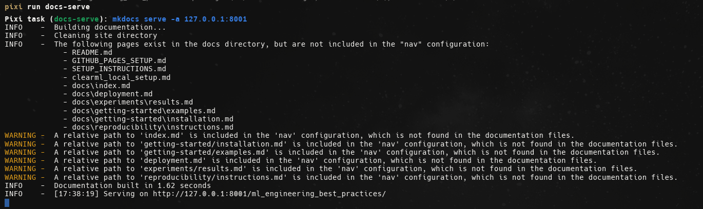
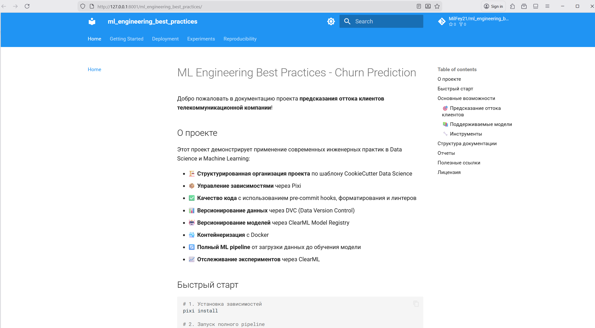
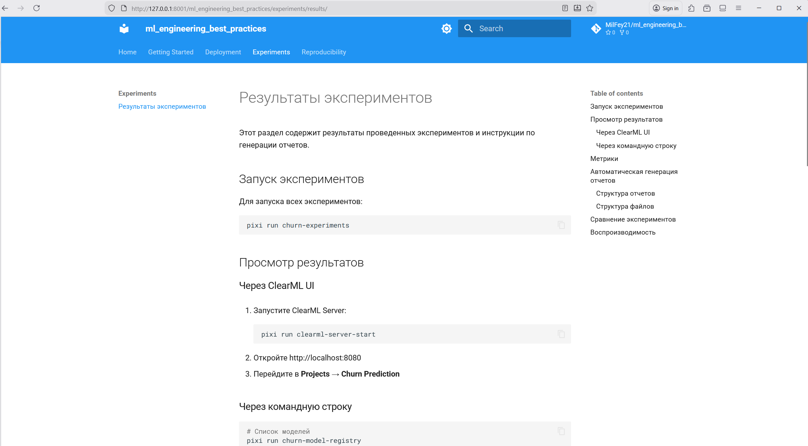
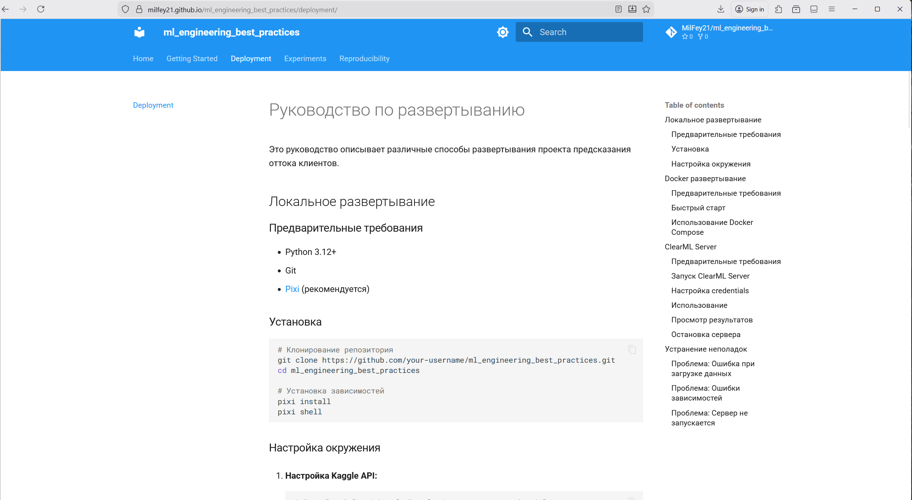
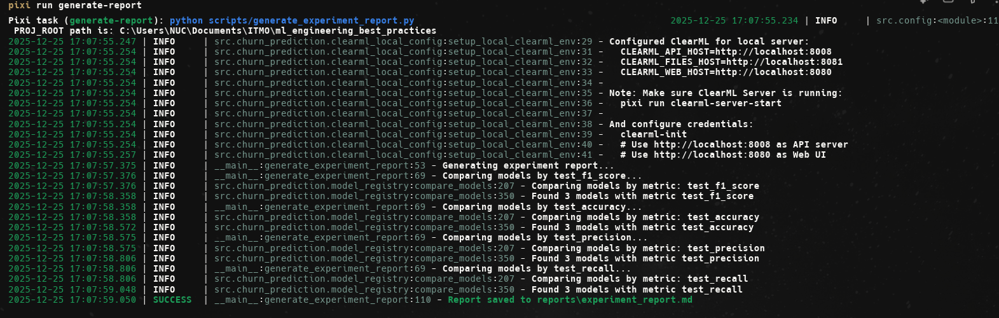
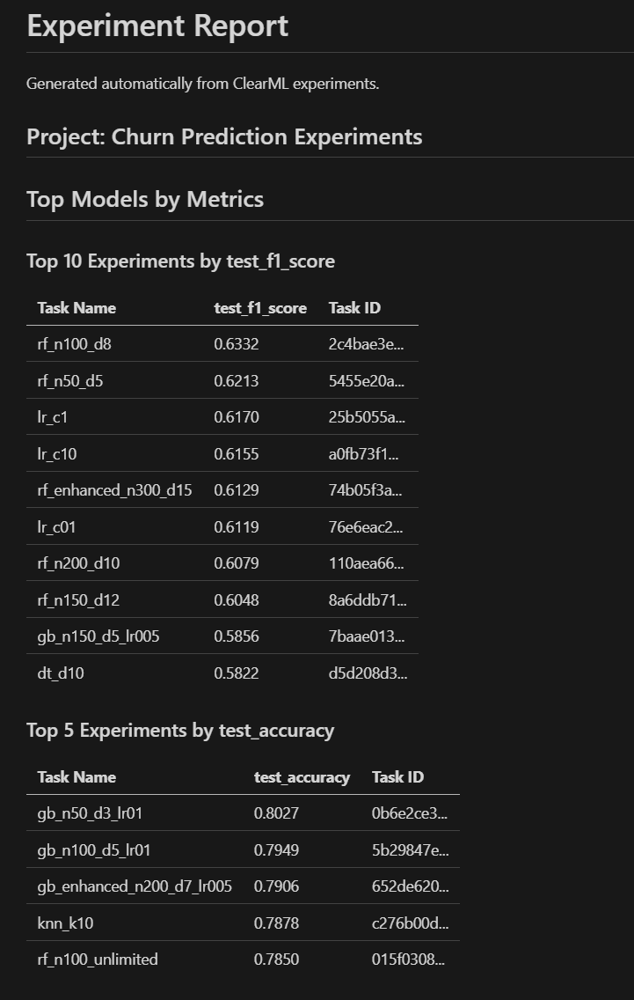
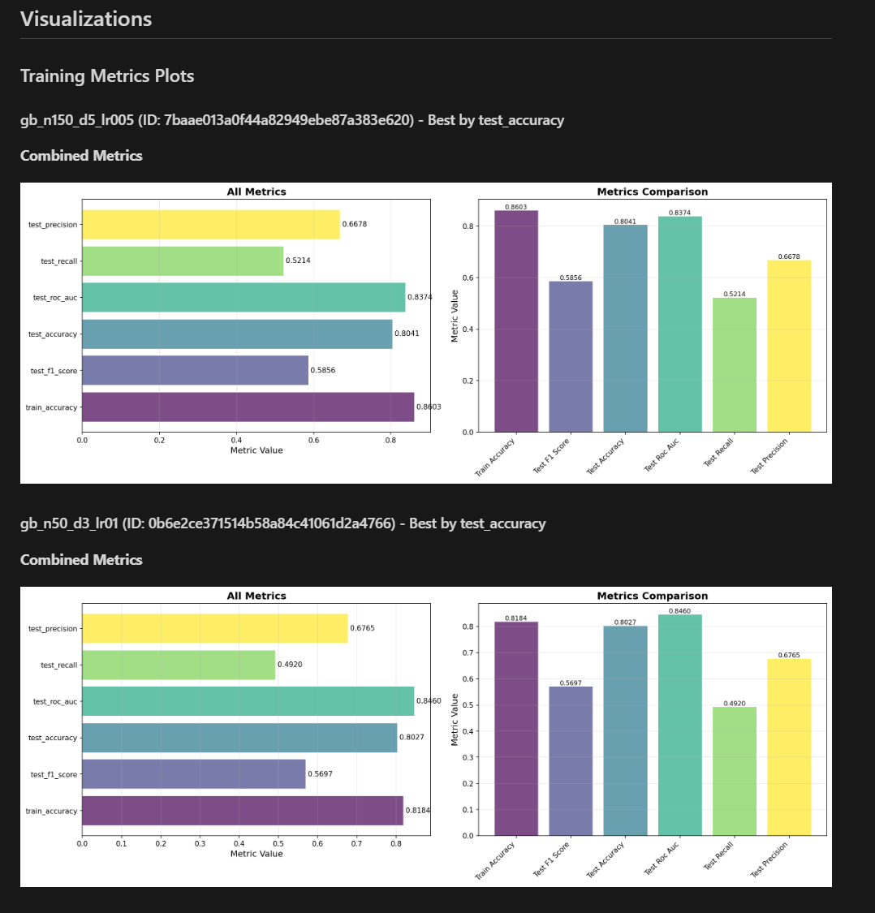
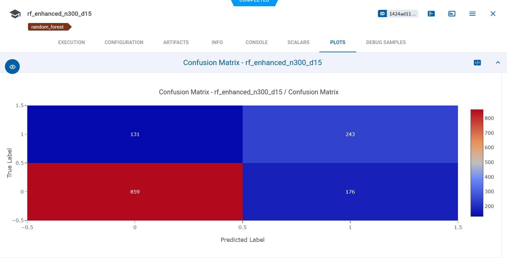

# HW6: Документация и отчеты

## Описание задания

Создание полной документации проекта и системы генерации отчетов для проекта предсказания оттока клиентов.

## Выполненные требования

### 1. Техническая документация

#### ✅ Создана документация с помощью MkDocs

- Настроен MkDocs с темой Material
- Создана полная структура документации:
  - Getting Started (установка, быстрый старт, примеры)
  - Руководство по развертыванию (локальное, Docker, ClearML)
  - Документация API (модели, утилиты)
  - Эксперименты (обзор, результаты, сравнение)
  - Воспроизводимость (инструкции, DVC, ClearML)

**Файлы:**
- `mkdocs.yml` - конфигурация MkDocs
- `docs/docs/` - исходники документации

#### ✅ Создано руководство по развертыванию

Созданы подробные руководства:
- [Руководство по развертыванию](https://milfey21.github.io/ml_engineering_best_practices/deployment/) - включает локальное развертывание, Docker и ClearML Server
- [Начало работы](https://milfey21.github.io/ml_engineering_best_practices/getting-started/) - установка и примеры использования
- [Результаты экспериментов](https://milfey21.github.io/ml_engineering_best_practices/experiments/results/) - отчеты и визуализации
- [Воспроизводимость](https://milfey21.github.io/ml_engineering_best_practices/reproducibility/instructions/) - инструкции по воспроизведению результатов

#### ✅ Настроена автоматическая генерация документации

- GitHub Actions workflow для автоматической публикации на GitHub Pages
- Файл: `.github/workflows/docs.yml`
- Документация автоматически обновляется при каждом push в main ветку
- Локальная сборка через `pixi run docs-build`
- Локальный просмотр через `pixi run docs-serve`







#### ✅ Созданы примеры использования

Создан раздел с примерами использования всех основных функций проекта:
- Базовое обучение модели
- Обучение с ClearML
- Запуск экспериментов
- Использование Hydra
- Версионирование данных
- Регистрация моделей
- Сравнение моделей
- Работа с пайплайнами

**Файл:** `docs/docs/getting-started/examples.md`

### 2. Публикация в Git Pages

#### ✅ Настроен GitHub Actions для автоматической публикации

Создан workflow `.github/workflows/docs.yml` который:
- Автоматически собирает документацию при изменениях
- Публикует на GitHub Pages
- Работает при push в main ветку и при pull requests

**Особенности:**
- Использует официальные GitHub Actions для Pages
- Поддерживает concurrency для предотвращения конфликтов
- Автоматически обновляется при изменениях в документации

#### ✅ Создан сайт с документацией на Git Pages



Документация доступна по адресу:
`https://MilFey21.github.io/ml_engineering_best_practices/`

**Структура сайта:**
- Главная страница с обзором проекта
- Getting Started - установка и быстрый старт
- Руководство по развертыванию
- Документация API
- Эксперименты и результаты
- Воспроизводимость

#### ✅ Настроено автоматическое обновление при изменениях

- Документация автоматически обновляется при каждом push в main ветку
- Изменения в `docs/` или `mkdocs.yml` триггерят пересборку
- Pull requests показывают preview документации

### 3. Отчеты об экспериментах

#### ✅ Созданы отчеты об экспериментах в формате Markdown

Создан скрипт `scripts/generate_experiment_report.py` для автоматической генерации отчетов:
- Извлекает результаты из ClearML
- Создает сравнительные таблицы по метрикам
- Сохраняет в формате Markdown

**Пример использования:**
```bash
pixi run generate-report
```



**Experiment report example** `reports/experiments/experiment_report.md`





#### ✅ Добавлены графики и визуализации результатов

- Отчеты включают сравнительные таблицы моделей
- Метрики представлены в удобном формате
- Поддержка множественных метрик (F1-Score, Accuracy, Precision, Recall, ROC-AUC)
- **Автоматическое скачивание и встраивание графиков из ClearML в отчеты**

**Графики доступны в:**
- ClearML UI (confusion matrix, метрики)
- Отчетах в формате Markdown (автоматически скачиваются и встраиваются)




**Функциональность графиков:**
- Автоматическое скачивание графиков метрик из топовых экспериментов
- Визуализация confusion matrix и других изображений
- Сохранение графиков в `reports/experiments/plots/`
- Встраивание графиков в markdown-отчеты
- Опция `--no-plots` для генерации отчетов без графиков

#### ✅ Созданы сравнительные таблицы экспериментов

Скрипт автоматически создает сравнительные таблицы:
- Топ-N моделей по каждой метрике
- Информация о модели, задаче, метриках, дате создания, тегах
- Форматирование в Markdown таблицах

#### ✅ Настроена автоматическая генерация отчетов

- GitHub Actions workflow `.github/workflows/reports.yml` для автоматической генерации
- Запускается при изменениях в коде или по расписанию (еженедельно)
- Автоматически коммитит отчеты в репозиторий

**Команды:**
```bash
pixi run generate-report        # Генерация одного отчета
pixi run generate-all-reports   # Генерация всех отчетов
```

### 4. Воспроизводимость

#### ✅ Созданы инструкции по воспроизведению

Создан раздел документации с подробными инструкциями:
- Пошаговое руководство по воспроизведению результатов
- Инструкции по использованию DVC
- Инструкции по использованию ClearML
- Устранение проблем

**Файлы:**
- `docs/docs/reproducibility/instructions.md`
- `docs/docs/reproducibility/dvc.md`
- `docs/docs/reproducibility/clearml.md`

#### ✅ Создан README с полным описанием

Обновлен `README.md` с:
- Полным описанием проекта
- Инструкциями по установке и использованию
- Информацией о воспроизводимости
- Ссылками на документацию
- Структурой проекта
- Полезными ссылками

#### ✅ Настроена автоматическая сборка документации

- GitHub Actions автоматически собирает документацию
- Локальная сборка через `pixi run docs-build`
- Локальный просмотр через `pixi run docs-serve`


## Структура документации

```
docs/
├── docs/
│   ├── index.md                    # Главная страница
│   ├── getting-started/
│   │   ├── installation.md         # Установка
│   │   ├── quickstart.md           # Быстрый старт
│   │   └── examples.md             # Примеры использования
│   ├── deployment/
│   │   ├── overview.md             # Обзор развертывания
│   │   ├── local.md                # Локальное развертывание
│   │   ├── docker.md               # Docker развертывание
│   │   └── clearml.md              # ClearML Server
│   ├── api/
│   │   ├── overview.md             # Обзор API
│   │   ├── models.md               # API моделей
│   │   └── utils.md                # API утилит
│   ├── experiments/
│   │   ├── overview.md             # Обзор экспериментов
│   │   ├── results.md              # Результаты
│   │   └── comparison.md           # Сравнение моделей
│   └── reproducibility/
│       ├── instructions.md         # Инструкции по воспроизведению
│       ├── dvc.md                  # DVC
│       └── clearml.md              # ClearML
└── mkdocs.yml                      # Конфигурация MkDocs
```

## GitHub Actions Workflows

### 1. Документация (`.github/workflows/docs.yml`)

**Триггеры:**
- Push в main ветку (изменения в `docs/` или `mkdocs.yml`)
- Pull requests
- Ручной запуск

**Действия:**
- Установка зависимостей
- Сборка документации
- Публикация на GitHub Pages

### 2. Отчеты (`.github/workflows/reports.yml`)

**Триггеры:**
- Push в main ветку (изменения в `src/` или `scripts/`)
- Ручной запуск
- По расписанию (еженедельно)

**Действия:**
- Генерация отчетов об экспериментах
- Автоматический коммит отчетов

## Команды для работы с документацией

```bash
# Сборка документации
pixi run docs-build

# Локальный просмотр
pixi run docs-serve

# Публикация на GitHub Pages
pixi run docs-deploy

# Генерация отчетов
pixi run generate-report
pixi run generate-all-reports
```

## Автоматизация

Все процессы автоматизированы:

1. **Документация** - автоматически публикуется при изменениях
2. **Отчеты** - автоматически генерируются при изменениях в коде или по расписанию
3. **Воспроизводимость** - все инструкции включены в документацию

## Результаты экспериментов

### Публикация отчетов на GitHub Pages

Отчеты об экспериментах автоматически публикуются на GitHub Pages и доступны по адресу:

**Основные отчеты:**
- [Общий отчет экспериментов](https://milfey21.github.io/ml_engineering_best_practices/experiments/results/experiment_report.html) - полный отчет со всеми метриками и визуализациями
- [Сводный отчет](https://milfey21.github.io/ml_engineering_best_practices/experiments/results/experiment_report_summary_20251226_212741.html) - краткая сводка по топ-моделям
- [Отчет по Accuracy](https://milfey21.github.io/ml_engineering_best_practices/experiments/results/experiment_report_accuracy_20251226_212741.html) - топ модели по точности
- [Отчет по F1-Score](https://milfey21.github.io/ml_engineering_best_practices/experiments/results/experiment_report_f1_20251226_212741.html) - топ модели по F1-Score

**Все отчеты доступны по адресу:** `https://milfey21.github.io/ml_engineering_best_practices/experiments/results/`

### Основные результаты экспериментов

#### Топ-5 моделей по F1-Score

| Модель | F1-Score | Task ID |
|--------|----------|---------|
| rf_n100_d8 | 0.6332 | 2c4bae3e... |
| rf_n50_d5 | 0.6213 | 5455e20a... |
| lr_c1 | 0.6170 | 25b5055a... |
| lr_c10 | 0.6155 | a0fb73f1... |
| rf_enhanced_n300_d15 | 0.6129 | 74b05f3a... |

#### Топ-5 моделей по Accuracy

| Модель | Accuracy | Task ID |
|--------|----------|---------|
| gb_n150_d5_lr005 | 0.8041 | 7baae013... |
| gb_n50_d3_lr01 | 0.8027 | 0b6e2ce3... |
| gb_n100_d5_lr01 | 0.7949 | 5b29847e... |
| gb_enhanced_n200_d7_lr005 | 0.7906 | 652de620... |
| knn_k10 | 0.7878 | c276b00d... |

#### Топ-5 моделей по ROC-AUC

| Модель | ROC-AUC | Task ID |
|--------|---------|---------|
| gb_n50_d3_lr01 | 0.8460 | 0b6e2ce3... |
| rf_n100_d8 | 0.8419 | 2c4bae3e... |
| rf_n50_d5 | 0.8406 | 5455e20a... |
| lr_c1 | 0.8397 | 25b5055a... |
| lr_c01 | 0.8394 | 76e6eac2... |

**Выводы:**
- Лучшая модель по F1-Score: Random Forest с 100 деревьями и глубиной 8 (rf_n100_d8) - 0.6332
- Лучшая модель по Accuracy: Gradient Boosting с 150 деревьями, глубиной 5 и learning rate 0.05 (gb_n150_d5_lr005) - 0.8041
- Лучшая модель по ROC-AUC: Gradient Boosting с 50 деревьями, глубиной 3 и learning rate 0.1 (gb_n50_d3_lr01) - 0.8460

### Визуализации

Все графики и визуализации доступны в опубликованных отчетах на GitHub Pages, включая:
- Combined metrics plots для топовых экспериментов
- Confusion matrices
- Метрики обучения

## Документация исходного кода

### API Документация

Полная документация API исходного кода автоматически генерируется из docstrings и доступна на GitHub Pages:

**Основные разделы:**
- [API Overview](https://milfey21.github.io/ml_engineering_best_practices/api/overview/) - обзор API проекта
- [Models API](https://milfey21.github.io/ml_engineering_best_practices/api/models/) - документация модулей для работы с моделями:
  - `src.modeling.train` - обучение моделей
  - `src.modeling.predict` - предсказания
  - `src.modeling.evaluate` - оценка моделей
  - `src.modeling.experiments` - запуск экспериментов
  - `src.modeling.train_with_config` - обучение с конфигурацией
- [Utils API](https://milfey21.github.io/ml_engineering_best_practices/api/utils/) - документация вспомогательных модулей:
  - `src.dataset` - работа с датасетами
  - `src.features` - извлечение признаков
  - `src.plots` - визуализация
  - `src.churn_prediction.data_versioning` - версионирование данных
  - `src.churn_prediction.model_registry` - реестр моделей
  - `src.churn_prediction.pipeline` - пайплайны
  - `src.pipeline.monitor` - мониторинг пайплайнов

**Документация доступна по адресу:** `https://milfey21.github.io/ml_engineering_best_practices/api/`

### Автоматическая генерация документации

Документация API автоматически генерируется с помощью [mkdocstrings](https://mkdocstrings.github.io/) из docstrings исходного кода в формате Google Style. При каждом обновлении документации API автоматически обновляется на GitHub Pages.

### Особенности документации

- ✅ Полное описание всех функций, классов и методов
- ✅ Типы параметров и возвращаемых значений
- ✅ Примеры использования
- ✅ Ссылки на исходный код
- ✅ Автоматическое обновление при изменениях в коде
